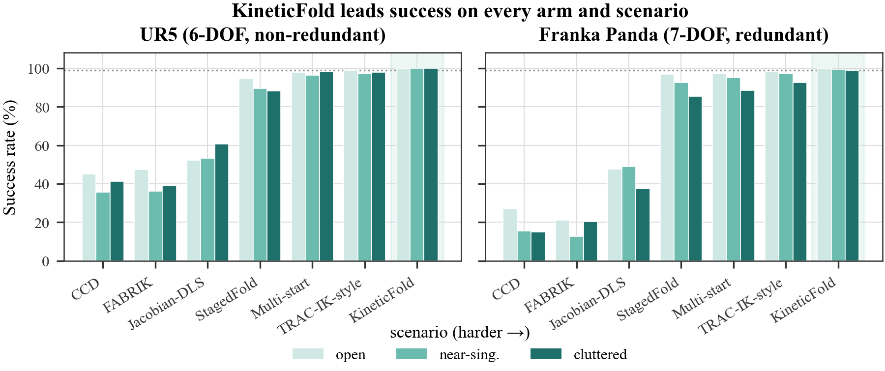
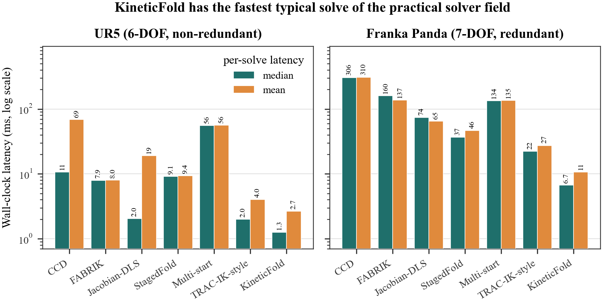
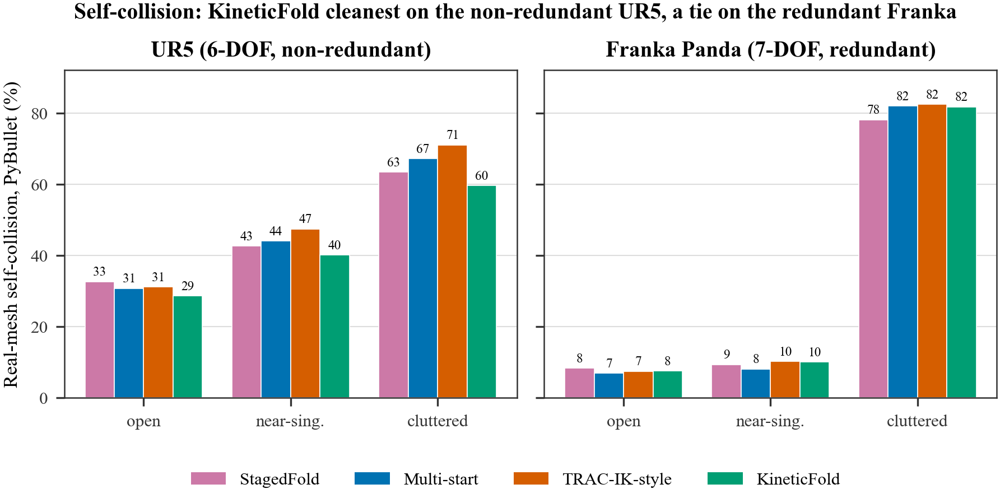

# ProteinIK: Inverse Kinematics as a Protein-Folding Process

## Abstract

Inverse kinematics (IK) and protein folding are structurally the same search problem: a chain of rigid segments whose only
free variables are the rotations between neighbouring segments, searching a rugged, constrained landscape for a
configuration that satisfies its boundary conditions. We take this correspondence literally and construct an IK solver
from the _process_ that proteins use to fold. StagedFold ports folding's ordered stages — local settling before the
target is consulted, coarse collapse, a funnelled narrowing search, a scoped chaperone rescue, and a native-state
stability check — into an IK algorithm. Its individual moves are standard IK; the folding-inspired _sequence_, together
with two moves that are unusual in this setting (a target-blind first stage and a scoped-then-escalating rescue),
constitute the contribution. StagedFold outperforms simple classical baselines but plateaus below production solvers,
which motivates KineticFold: it adds folding's _kinetic partitioning_ as a compute schedule, attempting a cheap
downhill fold first and paying for the full staged search only on genuinely frustrated targets. KineticFold leads a
strong baseline field (Jacobian-DLS, CCD, FABRIK, TRAC-IK-style, Multi-start) on success across three arms (at or near
100% on UR5, 98.7–99.8% on Franka) and has the lowest self-collision rate of any solver on the non-redundant arm — a ranking, not
an absolute; it
is also faster than TRAC-IK-style in the easy regime on both mean and median (up to ≈3.3× on Franka), paying a heavier
tail on the cluttered cells (UR5-cluttered p99 ≈655 ms vs. ≈154 ms for TRAC-IK-style). Every result is
validated against two independent physics simulators (PyBullet and MuJoCo): our forward kinematics agree with both to
floating-point precision, and both engines
corroborate — and appropriately shrink — our self-collision claims. Finally, a literal folding simulation (LangevinFold)
produces near-collision-free solutions on the non-redundant arm's unobstructed regimes at a latency cost, indicating
that faithful biophysics buys solution quality rather than speed. The contribution is an organizing _principle_ for IK rather than a
new energy function, and it yields the largest gains precisely where the arm behaves most like a folding polymer — a
per-solve advantage over the standard baseline field, against which selection-based methods (e.g. clearance-selecting
Multi-start) remain competitive.

## Keywords

Inverse kinematics; protein folding; kinetic partitioning; self-collision avoidance; simulated annealing; redundant
manipulators; physics-based validation.

## 1. Introduction

Inverse kinematics — finding the joint angles that place a robot's end effector at a target pose — is deceptively hard.
The map from configuration to pose is nonlinear; a target may admit many solutions or none; the Jacobian loses rank at
singularities; and a redundant or long arm can reach the target while folding into itself. Classical solvers confront
this as a single optimization to be minimized from the first iteration, whether by damped least squares, cyclic
coordinate descent, reaching heuristics, or restart-based search, driving pose error down a landscape they treat as one
basin to descend.

This is the same search a protein performs when it folds. A protein backbone is a chain of rigid bonds whose only soft
degrees of freedom are the dihedral rotations between residues; a robot arm is a chain of rigid links whose only
degrees of freedom are the joint angles. A protein reaches its native state by descending a rugged free-energy
landscape riddled with local minima, kinetic traps, and steric (self-overlap) constraints; an IK solver searches a
landscape with local minima, singular regions, and self-collision basins. The correspondence is not a loose analogy but
a structural isomorphism (Table 1): the two problems share their variables, their constraints, and the shape of the
space they search. We make this precise in Section 3.1 (Figure 1).

**Table 1.** The folding / inverse-kinematics isomorphism.

| Protein folding                              | Inverse kinematics                   |
| -------------------------------------------- | ------------------------------------ |
| Backbone dihedral angles φ/ψ (soft DOF)      | Joint angles `q` (the DOF)           |
| Rigid bonds / fixed bond lengths             | Fixed link lengths (FK constraints)  |
| Native (folded) state                        | The IK solution configuration        |
| Free-energy funnel                           | Convergence basin to the target      |
| Rugged landscape / kinetic traps             | Local minima / failed solves         |
| Excluded volume (sterics)                    | Self-collision avoidance             |
| Hydrophobic collapse                         | Coarse approach to the target region |
| Secondary structure (local order)            | Local joint settling                 |
| Molecular chaperone (GroEL)                  | Restart / rescue from a stuck state  |
| Kinetic partitioning (fast vs. slow folders) | Easy vs. hard targets                |

The bridge between the two fields is already load-bearing in one direction. Cyclic coordinate descent (CCD), a robotics
IK algorithm, was adopted into structural biology for protein loop closure [1]. An algorithm has already crossed from IK
into folding; the present work carries the _process_ back the other way — not a single move, but the ordered sequence
that nature uses to fold.

The thesis is as follows. Inverse kinematics is structurally a protein-folding problem, so an IK solver built from
folding's process should win exactly where the problem becomes most folding-like. We defend this claim with three
solvers of increasing biological literalness and a dual-simulator validation methodology.

The contributions of this paper are:

1. **A design principle** that casts IK as a folding _process_: to our knowledge the first IK solver organized as a
   staged fold with kinetic partitioning and chaperone rescue. The novelty is the _organization_, together with two
   moves that are unusual in this context (target-blind-first initialization and scoped-then-escalating rescue); it is
   not a new energy function. Each numerical ingredient is standard IK, so any advantage derives from the sequencing.
2. **KineticFold**, which recasts kinetic partitioning as a _compute schedule_ that pays the full staged-search cost
   only on frustrated targets. It is the success leader across three arms, faster than TRAC-IK-style in the easy regime
   (on both mean and median), paying a heavier tail only on the frustrated cluttered cells, and the cleanest practical
   solver on self-collision on the non-redundant arm.
3. **A dual-simulator validation methodology** — "solve once, score three ways" (a capsule proxy plus PyBullet and
   MuJoCo) — that independently confirms every success claim on two engines and _corrects_ our own
   collision-magnitude claim.
4. **A characterization** of where the principle pays off (the per-solve edge grows with chain length), where it ties
   (the redundant arm gives every solver room to dodge self-collision), and where literal folding physics buys quality
   at a latency cost.

The central empirical result is as follows. As a planar arm is lengthened from 4 to 16 joints — made progressively more
polymer-like — KineticFold's single-shot collision-free solve rate degrades the most gracefully of the standard field,
until it is the last method producing clean folds at all. At that point the correspondence stops being an analogy and
becomes the mechanism: the method wins because the problem _becomes_ folding.

## 2. Related Work

We review the field along the axis that matters for our argument — how each method behaves when the search stalls —
followed by the folding theory we port and the prior crossings between the two disciplines that make the port more than
an analogy.

**Jacobian- and optimization-based IK.** Velocity-level IK descends from resolved-motion-rate control, which maps
end-effector rates to joint rates through the Jacobian (pseudo)inverse [2]. The raw pseudoinverse is unbounded near
singularities, which damped least squares (DLS) regularizes with a damping term that trades a little accuracy for
stability [3], [4], with singularity proximity quantified by the manipulability measure √det(JJᵀ) [5] and refined by
selective damping [6]. Position-level solvers cast IK as nonlinear least squares and apply Levenberg–Marquardt [7], [8],
the optimization twin of DLS. All of these are single-trajectory local optimizers: they follow one gradient from one
seed and settle into whatever basin they start in, with no intrinsic mechanism to escape a local minimum. We include
Jacobian-DLS as a baseline and reuse a damped-least-squares step inside our own solvers.

**Sampling and restart IK.** Production solvers wrap a local core in global restarts. TRAC-IK [9] runs a joint-limited
Newton solver — an extension of KDL [10] — concurrently with an SQP optimizer and returns the first to converge; when
the Newton branch detects stagnation (no progress between successive iterates) it re-seeds from a fresh random
configuration. Because the reference implementation does not share our kinematics and collision core, our key baseline
(`TRAC-IK-style`) reimplements this restart-on-stall strategy behind the same interface, so the comparison isolates the
search _strategy_ rather than the implementation. Multi-start applies the same idea in the open: it runs several independent seeds and keeps
the best. Both are strong production methods, and both, when stuck, discard the accumulated partial solution and
restart globally. Analytical generators such as IKFast [11] sidestep iteration by emitting closed-form solutions, but
only for chains with special solvable structure; they do not generalize to redundant arms or arbitrary constraints.
This global-restart-on-stall behaviour is precisely what our chaperone rescue replaces with a _scoped_ perturbation
(Section 3.2).

**Heuristic IK.** Geometric heuristics trade the Jacobian for cheap per-joint updates: CCD rotates one joint at a time
along the chain [12], and FABRIK reaches forward and backward along the links with no matrix inversion [13]. Both are
fast on easy targets and degrade on constrained ones; we include both as baselines. CCD is also our bridge to biology,
discussed below.

**Learning-based IK.** A more recent line learns the IK map from data — IKFlow, for instance, trains a normalizing flow
to sample the full multimodal solution set for a target pose [14]. Such methods trade an expensive, per-robot training
phase for fast inference; they are orthogonal to our contribution, which is training-free and applies to a new arm
immediately.

**Biology-inspired IK.** Metaheuristic solvers already borrow from biology, but they borrow a _search operator_ rather
than a folding _process_. Memetic IK combines population-based mutation and selection with local gradient refinement
[15], [16], and genetic-algorithm and particle-swarm variants import crossover/selection or flocking dynamics as the
rule that proposes the next joint configuration. In every case biology supplies only the update operator; none
organizes the solve as a staged fold with a chaperone rescue gated by kinetic partitioning. That organizing principle
is our contribution, and by design the constituent numerical moves are standard, so any advantage must come from the
sequencing rather than from a novel energy term.

**Folding theory.** The native state is the sequence-encoded free-energy minimum [17], and it cannot be reached by
exhaustive conformational search [18]; it is reached instead by biased descent down a rugged but funnel-shaped,
minimally frustrated landscape [19], [20], [21], [22] — the direct analog of a well-shaped IK cost basin. We port three
mechanisms from this theory in particular: _kinetic partitioning_, in which some molecules fold directly while the rest
are kinetically trapped and fold slowly [23] (KineticFold's compute schedule, Section 3.3); _iterative-annealing
chaperone action_, in which GroEL rescues trapped chains by repeated partial unfolding and refolding [24], [25]
(StagedFold's scoped rescue, Section 3.2); and _coarse-grained off-lattice bead models_ [26], with hydrophobic collapse
as the compaction drive [27], which are the lineage of LangevinFold (Section 3.4).

**The bridge is already load-bearing in one direction.** The two fields provably share machinery. CCD, a robotics IK
algorithm, was imported wholesale into structural biology for protein loop closure [1]; loop closure has likewise been
solved as an analytical kinematics problem [28], building on classical chain-closure geometry [29]; robot motion
planning has been used to map folding landscapes [30]; and a protein backbone is routinely modeled as a kinematic
linkage whose revolute joints are its dihedral angles [31], [32]. Every one of these crossings runs robotics → biology.
To our knowledge, the reverse — using the folding _process itself_ (funnels, chaperones, kinetic partitioning,
coarse-grained folding kinetics) as the computational engine of a robot-arm IK solver — has not been attempted. That
reverse crossing is the subject of this paper.

## 3. Methodology

This section is the paper's technical core. It states the folding/IK correspondence as a formal search problem
(Section 3.1), then builds three solvers of increasing fidelity to folding's process on top of it: StagedFold, which
ports folding's ordered _sequence_ (Section 3.2); KineticFold, which ports folding's _compute schedule_ (Section 3.3);
and LangevinFold, which ports folding's _physics_ outright (Section 3.4). Every numerical ingredient inside these
solvers is standard IK machinery; what each subsection contributes is how that machinery is organized.

### 3.1 Problem formulation: IK as a folding search

We state the correspondence of Table 1 formally, as the single object every solver in this paper — baseline and
folding-inspired alike — searches over.

**Configuration and forward kinematics.** A robot with `n` revolute joints has configuration `q ∈ ℝⁿ`, bounded
componentwise by joint limits `q ∈ [q⁻, q⁺]`. Forward kinematics composes one rigid transform per joint. In the
standard Denavit–Hartenberg (DH) convention (UR5, planar arm):

```
Eq. (1)      Tᵢ(θᵢ) = Rot_z(θᵢ) · Trans_z(dᵢ) · Trans_x(aᵢ) · Rot_x(αᵢ)
```

with `θᵢ = qᵢ + θ_offset,ᵢ`. The Franka arm's official table is published in the _modified_ (Craig) convention, which
reorders the same four elementary transforms — `Tᵢ = Rot_x(αᵢ₋₁) · Trans_x(aᵢ₋₁) · Rot_z(θᵢ) · Trans_z(dᵢ)` — and is
not interchangeable with Eq. (1): feeding a modified-DH table through the standard-DH transform silently yields a
different, wrong robot, a correctness defect we identified and corrected (Section 4.1). Either convention composes into
the full chain and the end-effector pose

```
Eq. (2)      T(q) = T₁(q₁) · T₂(q₂) ··· Tₙ(qₙ),         p(q) = T(q)[1:3, 4],   R(q) = T(q)[1:3, 1:3]
```

The associated geometric Jacobian `J(q) ∈ ℝ⁶ˣⁿ`, the instantaneous map from joint velocities to end-effector twist,
has columns

```
Eq. (3)      J_{v,i} = zᵢ × (p_end − pᵢ),     J_{w,i} = zᵢ
```

where `zᵢ` is joint `i`'s rotation axis and `pᵢ` its origin, both read off the chain in Eq. (2) (which frame carries
`zᵢ` depends on the DH convention, per the reordering above).

**The task.** Given a target pose `T_target ∈ SE(3)`, the pose error is the 6-vector

```
Eq. (4)      e(q) = [Δp; Δω],     Δp = p_target − p(q),     Δω = Log_SO(3)( R_target · R(q)ᵀ )
```

where `Log_SO(3)` extracts the axis–angle rotation vector of a rotation matrix (`Δω = θ·axis`, with
`θ = arccos((tr(R_err) − 1)/2)`, `axis` read off the skew-symmetric part of `R_err`, and `Δω = 0` when `θ` is
numerically zero). A configuration is a _success_ if `‖Δp‖ < 1 mm` and `‖Δω‖ < 10 mrad`.

**The steric constraint.** Every link occupies volume, and the chain must not intersect itself. We quantify this with a
signed clearance

```
Eq. (5)      d(q) = min_{(i,j): |i−j| ≥ 2}  [ dist_seg( ℓᵢ(q), ℓⱼ(q) ) − (rᵢ + rⱼ) ]
```

where `ℓᵢ(q)` is the line segment between joint origins `pᵢ` and `pᵢ₊₁` (the capsule core of link `i`), `rᵢ` its
radius, and `dist_seg` the standard closest-point-between-segments distance [33], evaluated over every _non-adjacent_
link pair, since adjacent links share a joint and are never meaningfully colliding. `d(q) ≥ 0` means the arm clears
itself; `d(q) < 0` means interpenetration. A solve is _clean_ if it is both a success and satisfies `d(q) ≥ 0`. This
proxy is deliberately cheap — fast enough to sit inside an inner optimization loop — and, as Section 5.6 shows, it is
_optimistic_ relative to true mesh geometry. We therefore never quote it as an absolute rate, only as a same-tool
comparison across solvers, cross-checked against two independent full-mesh physics engines.

**The landscape.** Every solver in this paper, from single-trajectory Jacobian-DLS to our own, searches a combined
objective

```
Eq. (6)      E(q) = E_target(q) + E_limit(q) + E_collision(q) + …
```

(the exact terms and weights differ slightly by solver; Sections 3.2–3.4 give each one precisely, in closed form, down
to the calibrated constants). This objective is not convex: it has local minima wherever a joint configuration locally
reduces pose error without reaching the target, singular regions where `J(q)` loses rank and the local gradient stops
being informative, and collision-forbidden regions carved out by `d(q) < 0`. This is, structurally, a protein's
free-energy landscape — a rugged surface over the torsional degrees of freedom of a chain, punctuated by kinetic traps
and forbidden by excluded volume, whose global minimum is the native state [17], reachable only by biased descent down
a funnel and not by exhaustive search [18], [19]. Figure 1 renders the mapping of Table 1 schematically: joint angles
are dihedral angles, link-length constraints are bond-length constraints, the target-reaching basin is the folding
funnel, self-collision is steric exclusion, and a stuck search is a kinetically trapped molecule, rescued the way a
chaperone rescues a misfolded chain.


**Figure 1.** A protein backbone and a robot arm are both chains of rigid segments whose only free variables are the
rotations between neighbours (dihedral angles φ/ψ vs. joint angles `q`). Both search a rugged landscape — free energy
vs. pose error plus constraints — toward a stable target configuration, avoiding self-overlap. The right-hand column
indicates where each solver of Sections 3.2–3.4 sits on this correspondence.

We do not claim that `E(q)` requires new terms to become "more biological": every term defined in Sections 3.2–3.4 is
standard in the IK literature. Our claim is that the _order_ in which a solver visits this landscape, and the _schedule_
by which it decides how much of the landscape to search, should be organized the way folding organizes them: settle
locally before consulting the goal, collapse coarsely before refining, escalate a stuck search only as far as needed,
and — the lever that makes this practical — spend the expensive search only on targets the landscape genuinely makes
hard. The next three subsections build solvers of increasing fidelity to that process.

### 3.2 StagedFold: the folding process as an algorithm

Every classical IK method reviewed in Section 2 treats the arm as a single objective to be minimized from the first
iteration. StagedFold instead runs the arm through the same _ordered stages_ a protein visits while folding: settle
locally without consulting the target, collapse coarsely toward the target region, run a funnelled search that narrows
in, invoke a scoped chaperone if the search stalls, and finally verify that the solution is _stable_ rather than
balanced on a knife-edge. Every individual move below is standard IK; the sequence is the idea, together with two moves
that are, to our knowledge, new in this context: a target-blind first stage, and a rescue that starts scoped and
escalates to a global reseed only as a last resort. Defaults across all experiments: `max_iters = 200`,
`pos_tol = 1e-3`, `orient_tol = 1e-2`.

Every stage draws on five energy primitives, given once here in closed form (weights `wₓ` are set per stage below):

```
Eq. (7)   E_target(q)    = ‖Δp‖ + 0.3·‖Δω‖                                              (Eq. 4's e(q))

Eq. (8)   E_limit(q)     = 50 · Σᵢ pᵢ(fᵢ),      fᵢ = (qᵢ − loᵢ) / (hiᵢ − loᵢ)   (fractional position in [0,1])
                            pᵢ(f) = (margin − f)²        if f < margin
                            pᵢ(f) = (f − (1 − margin))²  if f > 1 − margin,     margin = 0.05
                            pᵢ(f) = 0                    otherwise

Eq. (9)   E_collision(q) = 100 + 100·|d(q)|                        if d(q) ≤ 0
                            10 · ((0.05 − d(q)) / 0.05)²            if 0 < d(q) < 0.05
                            0                                       if d(q) ≥ 0.05

Eq. (10)  E_smooth(q)    = 0.5 · Σᵢ (qᵢ₊₁ − qᵢ)²

Eq. (11)  E_neutral(q)   = 0.5 · Σᵢ (qᵢ − q_neutral,ᵢ)²,     q_neutral = 0
```

`E_limit` and `E_collision` are the soft barriers in our energy implementation, verified against the committed
source: both are zero in the safe interior and grow — quadratically near a joint limit, quadratically then affinely
across the collision margin — rather than as a hard constraint, so gradient-based stages can still take a step near the
boundary instead of being blocked by it.

**3.2.1 Local-blind relaxation (secondary-structure analog).** Gradient-free coordinate descent, one joint at a time,
for six sweeps over the chain: for each `i`, try `qᵢ ± 0.3 rad` and keep whichever configuration lowers the
_target-blind_ local energy

```
Eq. (12)   E_blind(q) = E_neutral(q) + E_smooth(q) + E_limit(q)          (E_target never enters)
```

No production IK method we are aware of begins by ignoring the target; the purpose is to mirror local secondary
structure forming before the global fold commits, seeding every later stage from a relaxed, in-limits configuration
rather than an arbitrary one.

**3.2.2 Coarse collapse (hydrophobic-collapse analog).** The first stage that consults the target: a deliberately
_detuned_ DLS pull on the full 6-D pose error, for 10 iterations,

```
Eq. (13)   Δq = Jᵀ (J Jᵀ + λ² I₆)⁻¹ e(q),      λ² = 0.15² = 0.0225,      q ← clip(q + 0.4·Δq)
```

This moves the hand into the neighbourhood of the target without attempting precision — the computational analog of a
protein collapsing to a compact molten globule before its final contacts form. Eq. (13) is the same DLS update [3], [4]
used by our Jacobian-DLS baseline in Section 2; the only differences here are the deliberately loose damping and the
0.4 step scale, that is, a sequencing decision rather than a new step rule.

**3.2.3 Funnelled narrowing search (folding-funnel analog).** The main refinement stage, run for up to
`max_iters = 200` further iterations, alternates (a) a gradient-free, coordinate-wise stochastic local search inside a
shrinking radius and (b) one finer DLS gradient step, minimizing a fully weighted combined energy:

```
Eq. (14)   E_stage3(q) = 3.0·E_target(q) + 1.0·E_limit(q) + 2.0·E_collision(q) + 0.3·E_smooth(q)

Eq. (15)   qᵢ,try = clip( qᵢ + U(−rₜ, rₜ) ),      rₜ = 0.5 · 0.985ᵗ         (fired every other iteration)
           accept qᵢ,try  iff  E_stage3(q_try) < E_stage3(q)               (greedy — no Metropolis test)

Eq. (16)   Δq = Jᵀ (J Jᵀ + 0.05² I₆)⁻¹ e(q)                                (finer DLS step, every iteration)
```

The greedy accept-if-better rule in Eq. (15) is a deliberate distinction from both KineticFold's Phase-B fold and
LangevinFold (Sections 3.3–3.4): there is no temperature or Metropolis acceptance anywhere in StagedFold.

**3.2.4 Scoped chaperone rescue (the key differentiator from TRAC-IK).** A stall is detected by keeping a window of the
last 10 energy values and firing a rescue if progress over the window falls below `2e-4`. The misfolded joint is
identified by one-sided finite-difference sensitivity,

```
Eq. (17)   i* = argmaxᵢ | E_stage3(q + δ·eᵢ) − E_stage3(q) |,      δ = 0.05 rad
```

Rescue then re-randomizes a _contiguous window of joints_ centred on `i*`, on an escalation ladder of scopes
`[n/6, n/2, 5n/6, n]` (on the UR5: `[1, 3, 5, 6]`), leaving the rest of the already-settled chain untouched. Only the
final rung is a full random reseed of the whole chain. This is the precise contrast with TRAC-IK, whose stuck-detection
response is _always_ a full random restart (Section 2): StagedFold starts scoped and escalates toward global only as a
last resort, so on a persistently stuck target its behaviour converges to TRAC-IK's. The accurate characterization is
"scoped first, global only when scoped rescue has already failed repeatedly," not "never restarts globally."

**3.2.5 Stability-gated termination (native-state stability analog).** Once the search converges, the candidate
solution `q*` is jittered five times, `q* + δqₖ` with `δqₖ` scaled to ≈1 mm of tip motion, and rejected if
`E_stage3(q* + δqₖ) − E_stage3(q*)` exceeds a threshold on four or more of the five trials. This rejects knife-edge
solutions that satisfy the pose error only coincidentally, mirroring the requirement that Anfinsen's native state be a
_stable_ free-energy minimum, not merely _a_ minimum.

StagedFold outperforms the simple classical baselines (Jacobian-DLS, CCD, FABRIK) by wide margins but does not exceed
the strong production baselines (TRAC-IK-style, Multi-start) on success (Section 5.1) — precisely the gap that motivates
KineticFold. We report this as a load-bearing result: it is evidence that folding's _process_ alone, without folding's
_compute schedule_, plateaus below production methods.

Three ablations that we implemented and reverted show the specific choices above are not decorative. Replacing Stage 1's
neutral-pose anchor with a pure neighbour-coupling relaxation dropped cluttered success from 90.0% to 86.0%. Biasing
Stage 3's stochastic proposals with a rotamer-library prior improved mean clearance but reduced cluttered success to
67–76%. An allostery-inspired compensating step traded success for a small clearance gain and was removed. We report
these because a design principle that survives its own negative controls is more credible than one that has none.

### 3.3 KineticFold: kinetic partitioning as a compute schedule

**Diagnosis.** StagedFold's shortfall was never the average solve; it was the _tail_. On the unmodified,
always-run-every-stage fold, the slowest ≈10% of targets consumed ≈57% of total wall time. This rules out
micro-optimization as a fix: a bit-identical micro-pass over the same inner loop bought only 1.1–1.4×, because the cost
is not in _how_ the per-fold search runs but in _whether a target enters the expensive per-fold search at all_. The fix
must be structural, and folding already provides one.

**3.3.1 The barrierless-first ensemble.** Real proteins exhibit _kinetic partitioning_: some molecules fall straight
down a smooth funnel to the native state with no search at all ("downhill" folding), while the rest are kinetically
trapped and require chaperone intervention [23]. KineticFold ports this as a _compute schedule_ rather than a search
heuristic. A single budget of `max_replicas = 6` governs two phases.

_Phase A (barrierless)._ Each replica runs a cheap adaptive Levenberg–Marquardt polish (≤ 30 LM steps); replica 0 seeds
from `q0`, the rest from random configurations. Each LM step is a damped Gauss–Newton update whose damping `λ`
self-tunes from the step's own outcome, Newton-fast when it helps and conservative when it does not:

```
Eq. (18)   Δq = Jᵀ (J Jᵀ + λ² I₆)⁻¹ e(q),        q_try = clip(q + Δq)
           if  E_target(q_try) < E_target(q):  accept q ← q_try,   λ ← max(0.5λ, 1e-4)
           else:                                reject,             λ ← min(2.5λ, 2.0)     (λ₀ = 0.08)
```

with the polish terminating early once `‖Δp‖ < pos_tol ∧ ‖Δω‖ < orient_tol`, or once `λ ≥ 2.0` (a persistent overshoot
signals that this replica will not converge downhill). As soon as any replica converges to a sterically clean solution
(`d(q) ≥ 0`), Phase A stops early with a success; most targets never see anything more expensive than Eq. (18). The
_frustration criterion_: a target is declared _frustrated_ — and only then escalated — if and only if, after all
Phase-A replicas have run, no converged replica is clash-free.

_Phase B (the full staged fold)_ fires only on frustrated targets: a StagedFold-style fold (coarse collapse → funnel →
chaperone rescue → stability gate, Sections 3.2.2–3.2.5) but with its Stage 3 funnel replaced by a _true
Metropolis-accepted_ search, a genuine refinement over StagedFold's greedy Eq. (15). KineticFold is therefore not
numerically identical to StagedFold; this layer changes solver behaviour, not merely its schedule. Each single-joint
candidate `q_try` (one coordinate perturbed by `U(−rₜ, rₜ)`, same shrinking radius as Eq. 15) is accepted with
probability

```
Eq. (19)   P(accept) = 1                                                    if E(q_try) < E(q)
                        exp( −(E(q_try) − E(q)) / Tₜ )                      otherwise

Eq. (20)   Tₜ = T₀ · (T_f / T₀)^{t / max_iters},      T₀ = 0.3,   T_f = 0.01
```

— the standard Metropolis criterion [34] under a geometric cooling schedule, so the funnel search can climb out of
shallow local minima early (`Tₜ` large) and freezes into greedy descent as `t → max_iters` (`Tₜ` small). Phase B is
closed out by the same LM endgame as Eq. (18) and is further capped to stop on the first clean fold, or after at most
two collision-aware converged folds. Attempting spontaneous folding first and invoking the chaperone only on failure is
how GroEL operates [25]; this ordering is more faithful to folding than always running the full machinery, not a
departure from it.

**3.3.2 Allocation-light FK primitives.** Independently of the schedule, the inner loop is made cheap and bit-identical
to the reference kinematics: a preallocated-buffer chain builder replaces per-joint array literals; an incremental
variant rebuilds only the _suffix_ of the chain when a Metropolis sweep perturbs a single joint; and pose and Jacobian
are fused into one forward-kinematics pass with a shared constant `6×6` identity in place of per-step allocation. We
verified bit-identical output against the reference FK on the UR5 and the planar arm (500 configurations each). We
state this scope precisely rather than claim coverage of all three arms, which the committed tests do not cover;
extending the check to Franka is an open item.

Naive tail-edits that preserve the fold order but simply spend less — capping replicas, bailing earlier, fewer
per-stage iterations — bought little speed and eliminated the headline result: at `cap_replicas = 2`, Franka open-space
success collapsed from ≈100% to 71.7%. The cost that matters is the _per-fold_ search, not the _number_ of folds
attempted, which is why the kinetic-partitioning gate (skip the expensive search entirely when unfrustrated) is the
correct lever and a naive budget cut is not.

### 3.4 LangevinFold: the literal folding simulation

StagedFold borrows folding's _process_; LangevinFold runs the _physics itself_. It treats the arm as a coarse-grained
molecule (one bead per joint origin) under thermal motion, and lets it fold under a genuine biophysical free energy,
cooling until it freezes into a solution. It is too slow for practical deployment (seconds per solve), but under
real-mesh collision testing it produces essentially collision-free solutions on the non-redundant arm's unobstructed
regimes (0.0% and 0.3% real-mesh self-collision on UR5 `open_space` and `near_singular`, well below any other solver in
the same sweep) — the cleanest self-collision profile in this study — indicating that faithful
biophysics buys solution _quality_ rather than speed. We give only the essential formulation here; the full treatment,
including the phase experiments behind these choices, is deferred to a subsequent extended study.

The arm is coarse-grained at one bead per joint origin `pᵢ(q)` (the FK chain of Eq. 2; the beads are read off the
existing kinematics, so nothing new is introduced). Bond lengths between beads are enforced exactly by FK, so the only
soft degrees of freedom are the joint angles `q` — precisely the Cα-level coarse-graining used in folding simulation
[26]. Reduced units are used throughout (`k_B = 1`, friction `γ = 1`, energy in units of `ε_H`, length in units of
`σ`).

**Free energy.** A single self-consistent temperature `T` simultaneously sets the entropic weight below, the Langevin
noise amplitude, and the cooling schedule — a physical constraint (fluctuation–dissipation), not a tuning convenience.
The dynamics minimize a temperature-dependent potential of mean force,

```
Eq. (21)   F(q; T) = E_task(q)  +  E_LJ(q)  +  E_HB(q)  −  T · S_conf(q)
                      └target┘   └──────────── folding physics (target-blind) ────────────┘
```

`E_LJ` is a full 6-12 Lennard-Jones potential _with attraction_, over every non-adjacent bead pair `|i−j| ≥ 2`:

```
Eq. (22)   E_LJ(q) = Σ_{j>i+1}  4εᵢⱼ [ (σᵢⱼ/dᵢⱼ)¹² − (σᵢⱼ/dᵢⱼ)⁶ ],     dᵢⱼ = ‖pᵢ − pⱼ‖,     σᵢⱼ = s·(rᵢ + rⱼ)
```

with a uniform well depth `εᵢⱼ = ε` (deliberately non-Gō, so that structure emerges rather than being planted) and a
global scale `s` calibrated per robot. The retained `−(σ/d)⁶` attraction — with well minimum at `dᵢⱼ = 2^{1/6}σᵢⱼ` — is
the one energy feature with no IK equivalent: it represents core packing and steric exclusion, and its emergent
preferred inter-link spacing plays the role of tertiary contacts.

`E_HB` is a directional "hydrogen-bond" term. Each bead carries a local backbone normal — the unit normal to the plane
of its own triplet, `tᵢ = normalize( (pᵢ − pᵢ₋₁) × (pᵢ₊₁ − pᵢ) )` — and, over the same non-adjacent pairs,

```
Eq. (23)   E_HB(q) = −ε_hb · Σ_{j>i+1}  F(dᵢⱼ) · G(t̂ᵢ·r̂ᵢⱼ) · H(t̂ⱼ·r̂ᵢⱼ)
           F(d) = exp( −(d − d₀)² / 2σ_d² ),        G(x), H(x) = exp( −κ(1 − |x|) )
```

`d₀, σ_d, κ, ε_hb` are calibrated per robot from natural-configuration geometry. `F` gates on distance; `G` and `H`
gate on the relative orientation of the two triplet normals to the inter-bead direction `r̂ᵢⱼ`. The term is stabilizing
only when both are satisfied simultaneously, which is what makes secondary-structure-like motifs form rather than a
diffuse attraction. (Interior-only: the planar 3-DOF arm has no interior triplet and hence no `E_HB` term.)

`S_conf` is a conformational entropy — the Boltzmann log-count of the locally accessible, clash-free, in-limits
configuration volume around `q`, estimated by a fixed Gaussian probe cloud (common random numbers, so the estimate is
smooth across steps):

```
Eq. (24)   Ω(q) ≈ (1/m) Σ_{k=1}^{m}  w_lim(q + δqₖ) · w_clash(q + δqₖ),     δqₖ ~ 𝒩(0, ρ²I)   (fixed per step)
           w_lim(q)   = Πⱼ σ(α(qⱼ − loⱼ)) · σ(α(hiⱼ − qⱼ))
           w_clash(q) = σ(α(d(q) − margin))                                    (σ = logistic sigmoid)
           S_conf(q)  = log( max(Ω(q), Ω_floor) )
```

`S_conf` carries no target/tolerance term — folding entropy is target-blind by construction — and is collision-aware
through `w_clash`, which is what separates it from manipulability √det(JJᵀ): manipulability is task/null-space-relative
and ignores self-collision entirely, whereas `S_conf` is not a re-derivation of it (measured correlation with clearance
≈ +0.9 for `S_conf` vs. ≈ 0 for manipulability, across all three arms). `S_conf` opposes collapse — high for open
configurations, low for compact, near-collision, or near-limit ones — and competes directly against `E_LJ` in
Eq. (21); the `T`-weighted crossover between the two is the folding transition.

`E_task` is the sole non-folding term. Folding has no notion of an external boundary condition, so it is kept minimal,
reusing the same pose error as every other solver:

```
Eq. (25)   E_task(q) = w_task · ( ‖Δp‖ + 0.3·‖Δω‖ ),      ∇E_task = −w_task · Jᵀ · e(q)
```

**Dynamics.** Overdamped Langevin integration, Euler–Maruyama discretization — pure force plus thermal noise, with no
Metropolis accept/reject anywhere (the defining distinction from simulated annealing and from KineticFold's Phase-B
funnel, Eq. 19):

```
Eq. (26)   ∇F = ∇E_task + ∇E_LJ + ∇E_HB − Tₜ·∇S_conf
           q_{t+1} = clip( q_t − ∇F·Δt + √(2Tₜ Δt) · ξₜ ),    ξₜ ~ 𝒩(0, Iₙ)     (step clipped to max_step = 0.25)

Eq. (27)   Tₜ = max( T_glass, T_start · e^{−t/τ} )
```

with `T_glass ≈ σ_E / √(2 ln Ω̄)` a per-robot glass-transition floor calibrated from a pre-solve landscape diagnostic
[19]. Cooling below `T_glass` without reaching the target basin is a measured _glassy trap_, reported as a solver
outcome rather than silently patched.

**Endgame.** As `T → 0` in Eq. (26) the noise term vanishes and the dynamics reduce to the deterministic flow
`dq = −∇F·dt`; near a minimum the basin is locally harmonic, so the natural, quadratically convergent continuation of
that same flow is a damped-Newton/LM step — not a foreign finisher, but the `T → 0` limit of the identical equation:

```
Eq. (28)   H ≈ Jᵀ J   (+ optional E_LJ/E_HB curvature),     Δq = −(H + μI)⁻¹ ∇F,     q ← clip(q + Δq)
```

iterated to tolerance once `Tₜ` reaches `T_glass`. This is folding's own last phase, native-state consolidation: final
packing and van-der-Waals/H-bond network locking into the unique native minimum. Among consolidated candidates the
solver selects the clash-free candidate of minimum enthalpy (excluded volume enforced as a hard constraint), drawn from
a multi-start ensemble of size `n_ws = 10 + 2·max(0, n−6)` and passed through the same jitter stability check as
StagedFold (Section 3.2.5).

Two qualifications are worth stating. LangevinFold's measured collision advantage traces in part to its
multi-start-plus-hard-selection endgame, not to the free-energy terms alone; and its "biophysics buys quality" claim is
only _measurable_ on a real-mesh oracle, since our own capsule proxy cannot see it (Section 5.6). Both are treated in
full in the extended study; here we report only the validated headline: the cleanest self-collision profile on the UR5
among all solvers in this study — near-zero on its unobstructed regimes — at a latency cost that restricts it to
offline, quality-critical use.

## 4. Experimental Setup

We test three arms of increasing kinematic hardness, three target scenarios of increasing difficulty, and a field of
six baselines spanning the IK literature of Section 2. The differentiator we rely on throughout Section 5 is that every
solver sees exactly the same targets, and every solver's final configuration is independently re-scored by two full
physics engines it never queried during solving. This section fixes every parameter of that protocol; all quantitative
results are traceable to a named committed benchmark run.

### 4.1 Robots

**Table 2.** Robots.

| Arm                | DOF | Notes                                                                                                                                                                                                                                                                                                                                                                                                                                                                          |
| ------------------ | --- | ------------------------------------------------------------------------------------------------------------------------------------------------------------------------------------------------------------------------------------------------------------------------------------------------------------------------------------------------------------------------------------------------------------------------------------------------------------------------------ |
| Planar 3-DOF (RRR) | 3   | link lengths `[0.4, 0.3, 0.2]` m; has an exact closed-form IK solution — the ground-truth validator for every numerical solver                                                                                                                                                                                                                                                                                                                                                 |
| UR5                | 6   | non-redundant; standard-DH; the primary tuning and validation arm                                                                                                                                                                                                                                                                                                                                                                                                              |
| Franka Panda       | 7   | redundant; requires the modified/Craig DH convention (Eq. 1's reordering, Section 3.1); using the standard-DH transform instead placed the computed end-effector ≈1.4 m from the real robot, a correctness defect we identified and corrected; verified against the `panda_link8` frame in franka_ros's official URDF [35] to ≈1e-7 m via PyBullet; tight, asymmetric joint limits, including joint 4 permanently confined to `[−3.07, −0.07]` rad (the elbow-down constraint) |

### 4.2 Scenarios (target generators)

Every scenario draws a joint configuration uniformly from the joint limits and forward-kinematics it into a Cartesian
target, so every target is reachable by construction:

```
Eq. (29)   q_cfg ~ U(q⁻, q⁺),      T_target = T(q_cfg)                         (Eq. 2's FK)
```

`open_space` uses Eq. (29) directly, with an independent fresh draw of the same form for the start configuration `q0`;
no geometric relationship between `q0` and the target is imposed, and no rejection sampling is applied. This is the
baseline difficulty distribution, and on its own it already yields configurations that are ≈40% near-singular by the
manipulability measure below.

`near_singular` and `cluttered` instead reject-sample Eq. (29) against a hardness criterion, keeping the best-scoring
draw seen if no draw clears the threshold within the try budget. The hardness criterion for `near_singular` is the
Yoshikawa manipulability index [5],

```
Eq. (30)   m(q) = √det( J(q) J(q)ᵀ )
```

evaluated on the full `6×n` Jacobian of Eq. (3) for UR5 and Franka, or on the reduced `3×n` planar sub-Jacobian
(x-velocity, y-velocity, z-angular-velocity rows) for the planar arm, whose full 6-row Jacobian is rank-deficient by
construction. A configuration is accepted once `m(q) < τ_ms`, per arm (Table 3), within `max_tries = 50`.

`cluttered` rejects on the self-collision clearance of Eq. (5) instead, accepting once `d(q) < −0.03` within
`max_tries = 200`. The `−0.03` m threshold is not arbitrary: over random UR5 configurations the median
min-self-distance is ≈0.020 m with a 5th percentile of ≈−0.06 m, so a threshold at the median (an earlier, looser
choice) accepted almost every first draw and failed to select distinctly harder configurations, whereas `−0.03` m sits
near the 5th percentile and does select for it.

**Table 3.** Scenario hardness thresholds.

| Scenario        | Criterion              | Threshold                                  | `max_tries`      |
| --------------- | ---------------------- | ------------------------------------------ | ---------------- |
| `open_space`    | none                   | —                                          | 1 (no rejection) |
| `near_singular` | `m(q) < τ_ms` (Eq. 30) | planar: 0.001 · UR5: 0.005 · Franka: 0.015 | 50               |
| `cluttered`     | `d(q) < −0.03` (Eq. 5) | −0.03 m (all arms)                         | 200              |

### 4.3 Baselines

Every baseline reuses the shared kinematics and pose error of Section 3.1 (Eqs. 2–4); Table 4 gives each solver's tuned
parameters, verified against the committed implementation.

**Table 4.** Baseline hyperparameters.

| Solver                   | Update rule                                                                                                         | Iteration budget              | Damping / population                             | Stagnation response                                                                                                                             |
| ------------------------ | ------------------------------------------------------------------------------------------------------------------- | ----------------------------- | ------------------------------------------------ | ----------------------------------------------------------------------------------------------------------------------------------------------- |
| Jacobian-DLS             | Eq. (13)'s DLS step, `step_scale = 1.0`                                                                             | `max_iters = 200`             | `λ = 0.05` (`λ² = 0.0025`)                       | none — single trajectory                                                                                                                        |
| CCD [12]                 | one-joint-at-a-time base→tip rotation; wrist joints (`min(3, max(1, n//2))`) blend a 0.5×-weighted orientation term | `max_iters = 300` full sweeps | n/a                                              | none                                                                                                                                            |
| FABRIK [13]              | forward/backward reaching; wrist orientation nudged 0.6× before each position pass                                  | `max_iters = 150`             | n/a                                              | none                                                                                                                                            |
| TRAC-IK-style [9]        | DLS (`λ = 0.05`) in attempts of `iters_per_attempt = 50`                                                            | `max_total_iters = 300`       | n/a                                              | global: if `combined = ‖Δp‖ + 0.3‖Δω‖` improves by `< 1e-5` over a window of 8 iterations, abandon the attempt and reseed `q ← random_config()` |
| Multi-start              | Eq. (13)'s DLS step per member, `max_iters_per_member = 60`                                                         | 60 × 8 members                | `population_size = 8` (`q0` + 7 random restarts) | best of 8 by `combined`, preferring converged members                                                                                           |
| Analytical (planar only) | closed-form trigonometric IK                                                                                        | exact                         | —                                                | —                                                                                                                                               |

TRAC-IK-style's stagnation rule is the exact behaviour StagedFold's chaperone (Section 3.2.4, Eq. 17) is built to
contrast with: both detect stagnation over a short window of recent progress, but TRAC-IK-style's only response is a
full random reseed, whereas StagedFold's is scoped-then-escalating.

### 4.4 Protocol and fairness

**Scale.** Two sweeps underlie the results. A broad survey runs `trials = 100` targets per seed at `seeds = [1, 2, 3]`
(`n = 300` per cell) across all three arms, every baseline, both folding solvers, and LangevinFold; it is the source for
the latency, planar-arm, and LangevinFold figures (LangevinFold being too slow to seed-average at scale). Because
success and real-mesh collision showed cell-to-cell variance under only three seeds (a 15–20 percentage-point swing
between draws on the harder collision cells), the headline success and collision numbers on the two physical arms (UR5
and Franka) are instead drawn from a dedicated high-precision sweep at `seeds = [1..10]` (`n = 1000` per cell), reported
explicitly rather than quoted from the cheaper 3-seed draw.

**Shared targets.** Within a cell, targets are drawn once per seed from `rng = default_rng(seed)` before the solver loop
begins, and the resulting target list is handed unchanged to every solver in that cell, so no solver ever sees an easier
draw than another. Per-trial solver RNG is decoupled and reproducible (`default_rng(seed * 1_000_003 + i)` for trial
`i`).

**Warm-up.** Each cell runs `warmup = 8` untimed solves before timing starts, from a separate fixed generator
(`default_rng(10_000 + w)`), so warm-up draws never overlap with or bias the timed trial stream.

**Timing.** Wall-clock is measured with a monotonic counter bracketing only the solver's iteration loop; target
generation and warm-up are excluded. Latency percentiles (p50/p95/p99) are computed on the _pooled_ set of timings
across all seeds in a cell, not averaged per seed and then combined, so the tail statistics reflect the full trial
population.

### 4.5 Metrics

For every trial we record: success (`‖Δp‖ < 1 mm ∧ ‖Δω‖ < 10 mrad`, Eq. 4); wall-clock latency (mean and p50/p95/p99,
the tail being a first-class metric); self-collision (`d(q) < 0`, Eq. 5) and mean clearance; joint-limit violations;
and restart count. A solve is _clean_ if and only if it is a success and collision-free.

### 4.6 Validation harness: solve once, score three ways

Every solver's final configuration `q*` from every trial is re-scored independently by two full-mesh physics engines it
never queried while solving: PyBullet [36] and MuJoCo [37], both loading the same URDF (resolved via the
robot_descriptions package [38] — the standard UR5 description and Franka's official franka_ros URDF [35]; MuJoCo loads
it through a URDF-to-MJCF-compatible rewrite that preserves fixed-joint links as separate bodies rather than fusing
them). Both queries are purely kinematic — PyBullet via `resetJointState` + `getLinkState`,
MuJoCo via a direct `qpos` write followed by `mj_kinematics` — so neither engine steps a physics simulation or resolves
contacts dynamically. Each is asked only where the links are at a given configuration and how close the non-adjacent
ones come. This makes the comparison apples-to-apples with our own DH-based FK and capsule proxy: three independent
geometric queries against the identical model, not a dynamics rollout against a kinematic one.

_FK agreement._ At backend construction we assert that our DH FK matches each engine to a residual `< 1e-4` m/rad;
measured residuals are far tighter (UR5 DH↔PyBullet `9.5e-7`, DH↔MuJoCo `4.2e-8`; Franka DH↔PyBullet `6.6e-7`,
DH↔MuJoCo `8.0e-16`; PyBullet↔MuJoCo agree to ≈4–6e-8 m on both arms), so every success claim in this paper holds
independently on two engines, including the corrected Franka kinematics of Section 4.1.

_Collision agreement._ Over `n = 2000` random configurations per arm, we compute the proxy clearance and both
engines' closest-point distances, then measure

```
Eq. (31)   sign-agree(A, B) = 100 · mean( [d_A(q) < 0] = [d_B(q) < 0] )     over n random q
Eq. (32)   corr(A, B)       = Pearson( d_A(q), d_B(q) )                     over n random q
```

for every engine pair. PyBullet and MuJoCo agree on the sign call 97.9% (UR5) to 99.1% (Franka) of the time with
correlation 0.88 (Franka) to 0.99 (UR5) on raw signed distance. The two independent oracles corroborate each other, so
a proxy-vs-oracle disagreement (Section 5.6) can be attributed to the proxy, not to noise between the oracles.

## 5. Results and Discussion

All numbers in this section come from benchmarking every solver on identical targets and re-scoring each solved
configuration in two independent physics simulators (PyBullet and MuJoCo). Two sweeps underlie the results: a broad
survey (`trials = 100` targets per seed × `seeds = [1, 2, 3]`, `n = 300` per cell) across all three arms, every
baseline, both folding solvers, and LangevinFold, which supplies the latency, planar-arm, and LangevinFold figures; and
a high-precision sweep on the two physical arms (UR5 + Franka, `seeds = [1..10]`, `n = 1000` per cell, core solver
field), which supplies the headline success and real-mesh-collision numbers. The DOF-scaling and deployment-role
figures come from a separate use-case study (Sections 5.4–5.5, `n = 120` per cell).

### 5.1 Success: KineticFold leads the field on both arms

Success is the most basic thing an IK solver must do — place the end effector within 1 mm and 10 mrad of the target
pose in a single solve (Eq. 4) — and it is where the field splits cleanly into two tiers. Figure 2 shows the
single-shot rate for every solver on the two physical arms; the two paragraphs below read it bottom tier first.



**Figure 2.** Single-shot success rate (%) for every solver on UR5 (left) and Franka Panda (right), bars grouped by
scenario on a difficulty ramp (light = `open_space` → dark = `cluttered`); the dotted line marks 99%. The two-tier
structure the paper argues for is immediate: the simple, single-trajectory baselines (CCD, FABRIK, Jacobian-DLS)
collapse on the harder scenarios, StagedFold trails the production field, and KineticFold alone holds a near-flat ~100%
across every cell of both arms. All values are from the 10-seed sweep (`n = 1000` per cell).

The **lower tier** is the simple, single-trajectory baselines (Jacobian-DLS, CCD, FABRIK). They collapse under both
arms' harder scenarios — none exceeds 50% on Franka, and all three degrade further from `open_space` to `cluttered`
(CCD falls 27.1 → 15.0% on Franka) — exactly the single-basin-descent failure mode Section 2 predicts for methods with
no restart mechanism. The two restart-capable production baselines recover most of that ground: TRAC-IK-style and
Multi-start hold 96–99% across UR5, slipping only on Franka's hardest cell (to 92.6% and 88.4% on Franka `cluttered`).
StagedFold — folding's _process_ without its _compute schedule_ — clears every simple baseline by wide margins (28–80
points across cells) yet trails those two production baselines on the same hard cells (85.5% on Franka `cluttered`),
the verdict anticipated in Section 3.2: process alone plateaus below production methods.

The **upper tier** is KineticFold by itself. It leads every cell on both arms, solving 100 / 99.8 / 100% of UR5
`open_space` / `near_singular` / `cluttered` targets and 99.8 / 99.5 / 98.7% on Franka. It is the only solver that stays
above 98.5% everywhere, the only one to reach a full 100% on any cell (UR5 `open_space` and `cluttered`), and even its
worst case — 98.7% on Franka `cluttered` — tops the best baseline there (TRAC-IK-style, 92.6%) by more than six points.
This is the gap kinetic partitioning buys over StagedFold's staged fold: the same folding machinery, re-scheduled,
turns a plateau below the production baselines into a lead over them.

A third arm reproduces the same ordering. The planar 3-DOF arm — which carries an exact closed-form solution and so
serves as the study's ground-truth validator (Table 2) — was run through the identical success sweep, and shows the
two-tier structure just as sharply: on `cluttered` KineticFold solves 100% of targets while Jacobian-DLS collapses to
0% and CCD and FABRIK to 33%, and only the restart-capable production baselines stay near it (TRAC-IK-style 97%,
Multi-start 91%). We report this arm as corroboration rather than fold it into Figures 2–4, for two reasons: it belongs
to the all-arms survey rather than the 10-seed run that anchors those figures, and — being a planar chain with no
three-dimensional mesh — it has no self-collision to contribute, which is exactly why the collision comparison of
Section 5.3 is confined to the two physical arms. Its load-bearing role in the argument is not this head-to-head but
the DOF-scaling sweep of Section 5.4, where the same planar chain, lengthened, becomes the paper's central result.

### 5.2 Speed: faster in the easy regime, with a tail on the hard cells

We first situate KineticFold's speed within the full field. Figure 3 reports each practical solver's median and mean
per-solve latency on both arms in the open-space regime, where every solver is timed on targets it genuinely attempts;
reported together, the two statistics separate a solver's typical cost from the right-skew its occasional slow solves
introduce.



**Figure 3.** Per-solve wall-clock latency (log scale) for every practical solver on UR5 (left) and Franka Panda
(right) in the open-space regime; each solver shows its median (teal) and mean (orange), with the millisecond value on
each bar. KineticFold has the fastest typical solve of the field on both arms (median 1.3 ms on UR5, 6.7 ms on Franka),
ahead of its closest rival TRAC-IK-style; the median–mean gap exposes right-skew, largest for the simple baselines whose
occasional slow runs (e.g. UR5 CCD, 11 ms median vs. 69 ms mean) inflate the average. LangevinFold is omitted — seconds
per solve, offline only (Section 3.4). Latency is from the 3-seed survey (`n = 300` per cell).

KineticFold has the fastest typical solve in the field on both arms — 1.3 ms median on UR5 and 6.7 ms on Franka — ahead
of its closest rival TRAC-IK-style (2.0 and 22.3 ms) and far ahead of the sampling and geometric baselines
(Multi-start, CCD, FABRIK), which run tens to hundreds of milliseconds. Its mean tracks its median closely (2.7 ms UR5,
10.6 ms Franka), whereas the simple baselines carry a heavy right-skew — UR5 CCD's median is 11 ms but its mean 69 ms —
from a minority of slow runs. This is the direct signature of Phase A's barrierless-first schedule (Section 3.3.1,
Eq. 18): most targets fall straight down the cheap LM polish and never enter the expensive staged fold.

The one regime where KineticFold pays is the hardest. On the cluttered cells its median stays competitive (UR5 37 vs.
TRAC-IK-style's 35 ms; Franka 10 vs. 14 ms, KineticFold in fact faster), but the frustrated minority that escalates to
Phase B stretches its upper tail: UR5-cluttered p99 reaches 655 ms against TRAC-IK-style's 154, and Franka-cluttered
404 ms against 99. This tail lands on exactly the cells with the most frustrated targets (Franka `cluttered`, where
≈82% of even KineticFold's solutions still clash on real mesh, Section 5.3). KineticFold thus pays for its ≈99% success
and cleaner collision profile (Section 5.3) with an occasional slow solve on a genuinely frustrated target, which
is why we position it for planning and offline generation rather than tight real-time control (Section 5.5). All
timings are wall-clock and carry OS scheduling noise on mean/p95/p99; success, collision, and error columns are
deterministic given the seed.

### 5.3 Self-collision: decisive on the non-redundant UR5, a tie on the redundant Franka

Because real-mesh collision rates swing 15–20 percentage points between different 3-seed draws (Section 4.4), this
comparison is drawn only from the dedicated 10-seed run (`n=1000`/cell, both PyBullet and MuJoCo), and only among the
four solvers that clear ≈90% success — a collision rate is meaningful only for a solver that actually reaches the
target. Figure 4 reports it for both arms.



**Figure 4.** PyBullet real-mesh self-collision rate (%) by scenario for the four high-success solvers, on UR5 (left)
and Franka Panda (right); MuJoCo agrees to within ≈1 point and preserves every ranking. On the non-redundant UR5
KineticFold is the lowest bar in every regime; on the redundant Franka all four solvers are statistically tied. Values
are from the 10-seed run (`n = 1000` per cell).

**UR5 — a decisive edge.** KineticFold has the lowest real-mesh collision rate of the field on all three scenarios and
on both engines: the per-cell verdict of the 10-seed sweep names it the cleanest ≥90%-success solver on every UR5 cell
(PyBullet
`open_space` 28.6%, `near_singular` 40.1%, `cluttered` 59.6%), while it simultaneously posts the highest success
(100 / 99.8 / 100). It does not buy cleanliness by dropping hard targets: StagedFold, whose lower success (88.2% on
`cluttered`) removes the most collision-prone targets from its own denominator, is nonetheless dirtier than KineticFold
in every regime (63.4 vs. 59.6% on `cluttered`), so KineticFold solves the hard targets _and_ clashes least on them.
Two qualifications a reviewer would raise. First, the edge is real but modest, not the multiplicative gap the capsule
proxy would suggest (Section 4.6 flags the proxy as systematically optimistic): KineticFold's collision rate runs
1.1–1.2× lower than TRAC-IK-style's, widening from 1.09× on `open_space` (28.6 vs. 31.1%) through 1.18× on
`near_singular` (40.1 vs. 47.4%) to 1.19× on `cluttered` (59.6 vs. 71.0%), and it penetrates ≈40% less deeply when it
does clash (cluttered mean clearance −0.0203 m vs. −0.0340 m). Second, the mechanism traces to Eq. (19)'s Metropolis
funnel and the collision term in Eq. (14): on frustrated targets, KineticFold's Phase-B search weights `E_collision` heavily
(coefficient 2.0 in Eq. 14, against 3.0 on the target term) and can escape shallow steric traps via thermal acceptance, whereas TRAC-IK-style's response to a
stall is a full random restart with no collision-directed search. LangevinFold is not part of this comparison (too slow
for the seed-averaged protocol), but its separately measured UR5 collision profile — essentially zero on the two
non-`cluttered` regimes — is carried forward in Section 5.5 as the "faithful biophysics buys quality" result.

**Franka — a tie, for a structural reason.** On `open_space` and `near_singular` every solver sits in a narrow 7–10%
band with no consistent ranking — a tie across the board. On `cluttered`, where the scenario actively forces
self-collision, KineticFold (81.7%) is statistically indistinguishable from TRAC-IK-style (82.4%) and Multi-start
(82.0%) — a tie, neither a loss nor a lead. The mechanism is structural rather than a solver weakness: Franka's
redundant 7th joint gives every solver a null-space direction to dodge self-collision
while still reaching the target, so the collision-directed search that gives KineticFold its UR5 edge above has
much less room to matter once a spare joint already does the dodging. We read this as corroborating, not undermining,
the UR5 result: the edge appears exactly where the arm has no redundancy to spare and disappears exactly where it does,
consistent with the thesis that the method's advantage should track how folding-like (chain-constrained, not gifted a
spare DOF) the problem is — a relationship the DOF-scaling experiment of Section 5.4 tests directly.

Taken together, Sections 5.1–5.3 draw one consistent picture. Success is unconditional: KineticFold leads or ties every
baseline on every arm and scenario, including the two it is built to exceed (TRAC-IK-style, Multi-start). The collision
edge, by contrast, is conditional on redundancy — decisive on the non-redundant UR5, where the chain has nowhere to
hide from its own search, and a tie on the redundant Franka, where a spare joint lets every solver dodge for free. That
conditionality is independent evidence _for_ the mechanism claimed in Section 3.3: the edge comes from
collision-directed search finding routes a restart-only baseline cannot, and such routes matter most exactly when the
chain is most constrained.

### 5.4 Scaling with chain length

The single result that turns the correspondence from an analogy into a mechanism is how the advantage scales with chain
length. On the planar arm we grow the joint count from 4 to 16 and measure the single-shot _clean-solve_ rate — reach
the target and be self-collision-free (proxy checker, `n = 120` per cell).

**Table 5.** Single-shot clean-solve rate (%) vs. degrees of freedom, planar arm (use-case study, `n=120` per cell).

| DOF | KineticFold clean% | TRAC-IK-style clean% |            ratio |
| --: | -----------------: | -------------------: | ---------------: |
|   4 |               75.8 |                 34.2 |             2.2× |
|   6 |               59.2 |                 16.7 |             3.5× |
|   8 |               36.7 |                  5.0 |             7.3× |
|  12 |               11.7 |                  0.8 |              14× |
|  16 |                1.7 |                  0.0 | KineticFold only |

Both methods reach the target ≈100% of the time; the entire gap is self-collision avoidance. As the arm lengthens into
a self-avoiding chain — a polymer — KineticFold degrades the most gracefully of the standard field and is eventually
the only standard-field method producing collision-free folds at all. The advantage widens monotonically with joint
count (2.2× at 4 DOF to KineticFold-only at 16), which is the correspondence proving itself: the method wins because
the problem becomes folding.

This result requires careful framing. It is a _single-shot_ advantage over the _standard baseline field_ specifically.
A clearance-selecting Multi-start (solve K times, keep the cleanest) is competitive on these redundant planar arms, and
such selection wrappers lift every solver. The accurate statement is therefore that KineticFold has the best per-solve
clean rate, and selection wrappers are a strong, orthogonal booster (Section 5.7).

### 5.5 Deployment roles

KineticFold's profile — high success, clean solutions, an occasional slow solve — fits planning, offline batch
generation, and reliability fallback rather than tight real-time control. As a planning
goal-sampler on UR5 `cluttered` it returns 83.4 usable clean goals per 100 attempts, against 56.9 (TRAC-IK-style) and
65.3 (Multi-start). As an offline clean-solve batch it leads the honestly comparable cells by +18–30 percentage points.
As a reliability fallback it rescues 60–78% of the targets TRAC-IK-style abandons.

LangevinFold, taking the biophysics literally at real computational cost, produces essentially collision-free solutions
on the non-redundant UR5's unobstructed regimes (0.0% and 0.3% real-mesh self-collision on `open_space` and
`near_singular`), the cleanest self-collision profile of any solver in this study (Section 3.4). It is too slow for
routine use (seconds per solve), but it demonstrates that the correspondence has more depth than optimization alone can
extract, and it is a candidate for offline, quality-critical generation where latency is not a constraint.

### 5.6 Dual-simulator validation

Every success and collision result above is re-derived on two physics engines that neither the solvers nor the target
generators ever saw, using the harness of Section 4.6.

The forward kinematics agree with both engines to floating-point noise (UR5 DH↔MuJoCo `4.2e-8` m, DH↔PyBullet `9.5e-7`;
Franka DH↔MuJoCo `8.0e-16`, DH↔PyBullet `6.6e-7`; PyBullet↔MuJoCo ≈4–6e-8 m on both arms), including the corrected
modified-DH Franka model, whose earlier standard-DH version was ≈1.4 m wrong and "succeeded" only because targets were
generated from the same incorrect FK. Every success claim is therefore independently true on two engines.

The capsule proxy is systematically optimistic — real meshes collide more — and both engines agree on that and with
each other (PyBullet↔MuJoCo sign-agreement 97.9–99.1%, correlation 0.88–0.99). We therefore report collision only as a
_ranking_ of solvers, never as an absolute rate, and we shrank our own proxy-based magnitude claim accordingly: the
proxy suggested a multiplicative UR5 advantage, whereas the real-mesh edge is the modest 1.1–1.2× of Section 5.3. On
the Franka the proxy is dominated by one fixed structural (elbow) link-pair and is nearly insensitive to the 7th joint,
which is the mechanism behind the Franka tie (Section 5.3), stated as a cause rather than buried. The UR5 collision
ranking and the Franka tie both reproduce identically on both engines. "Solve once, score three ways" (proxy +
PyBullet + MuJoCo) is the single reproducible artifact behind every collision claim in this section.

### 5.7 Limitations

The latency tail is the primary practical limitation: a minority of hard targets invoke the full staged fold, so
KineticFold is positioned for planning, offline, and quality-critical use rather than hard real-time control (Section
5.2). We report the full distribution rather than the mean alone.

The scaling result of Section 5.4 is a single-shot advantage over the standard field. A clearance-selecting Multi-start
is competitive on redundant planar arms, and selection wrappers lift all solvers; we do not claim absolute supremacy.

All collision claims concern _self_-collision only; no solver here reasons about a workspace obstacle. Collision rate on
real meshes is seed-sensitive, which is why both the UR5 and Franka collision headlines are averaged over 10 seeds
(`n = 1000` per cell). Finally, the capsule proxy is hand-tuned rather than derived from CAD, and its
allocation-light FK primitives' bit-identity is verified on the UR5 and planar arms (500 configurations each), the
scope we state; extending that check to Franka is an open item.

## 6. Conclusion and Future Work

A robot arm and a protein backbone are the same kind of object — a chain of rigid segments whose only freedom is the
rotation between neighbours, searching a rugged, constrained landscape for a configuration that satisfies its boundary
conditions (Section 3.1). We built three solvers that take that claim increasingly literally. StagedFold ports folding's
ordered _process_ — settle locally before consulting the goal, collapse coarsely, funnel narrowly, rescue what gets
stuck, verify what converges — using only standard IK machinery, and the sequencing alone clears every simple baseline
by wide margins, though it plateaus below the production baselines it does not yet out-schedule (Section 5.1).
KineticFold closes that gap not with new machinery but with folding's second idea, kinetic partitioning, recast as a
compute schedule: attempt the cheap downhill fold first, and reserve the expensive staged search for targets the
landscape actually frustrates (Section 3.3). The result is the success leader on every arm and scenario we tested,
including a 100 / 99.8 / 100 result on UR5 and a worst case of 98.7% on Franka `cluttered` — six points above the best
baseline there (Section 5.1); it is faster than TRAC-IK-style in the easy regime — on both mean and median — and pays a
heavier tail only on the frustrated cluttered cells (Section 5.2); and it is the cleanest practical solver on self-collision —
decisively on the non-redundant UR5, and tied on the redundant Franka for the structural reason of Section 5.3 —
confirmed independently on two physics engines that never saw our proxy (Sections 4.6, 5.6). The central result is the DOF-scaling climax: as a planar arm is lengthened from 4
to 16 joints and made progressively more polymer-like, KineticFold's single-shot clean-solve advantage over the
standard field widens monotonically, until by 16 DOF it is the only standard-field method still producing
collision-free solutions — a per-solve edge; a clearance-selecting Multi-start stays competitive and selection wrappers
lift every solver (Section 5.4).

The contribution is an organizing _principle_ rather than a new energy function. Every numerical ingredient in
StagedFold and KineticFold has precedent in the IK literature reviewed in Section 2. What is new is the claim, and the
evidence for it, that folding's staged, kinetically partitioned process is a better schedule for optimization machinery
IK already possesses, and that the payoff is not uniform but _diagnostic_: it appears where the arm is chain-constrained
(UR5, the DOF-scaling sweep) and recedes where the arm is handed an escape hatch (Franka's redundant 7th joint),
tracking the folding correspondence of Table 1 rather than implementation luck. We supported that reading with a
validation discipline uncommon in heuristic-IK work: every success claim reproduced on two physics engines to
floating-point precision, and every collision claim re-scored on real mesh rather than quoted from the proxy the
solvers optimize against — a check that in Section 5.6 _shrank_ our own collision-magnitude claim rather than
confirming it. Finally, LangevinFold, the literal folding simulation, indicates that the correspondence has more depth
than optimization alone can extract: taking the biophysics literally, at real computational cost, buys the cleanest
solutions of any solver in this study.

Several directions follow. **Environment obstacles.** Every collision claim here is self-collision only (Section 3.1,
Eq. 5); a workspace-obstacle term `E_obstacle` folds into the same staged, kinetically partitioned machinery of Eq. (6)
without changing either solver's organizing logic, and is the immediate next step toward deployability. **The full
LangevinFold study.** The calibration procedure, the phase-transition experiments that confirm the mechanism sequence
(unfolded ensemble → collapse → secondary structure → consolidation → native state), and the glass-transition
diagnostic are reserved for an extended study, where LangevinFold's biophysics can be treated at length. **Selection
wrappers.** The clearance-selecting Multi-start that tempers the Section 5.4 result is an orthogonal booster worth
studying in its own right, since it lifts all solvers. **Extending validated scope.** The allocation-light FK
primitives (Section 3.3.2) are verified bit-identical on UR5 and the planar arm, not yet on Franka; and a
faster, faithfully-behaved variant of KineticFold's inner loop is one verification pass from being folded into the
validated solver. These are concrete next steps rather than loose ends.

The correspondence of Table 1 was proposed as a mapping with no result behind it. Section 3 then implemented it without
needing a single energy term the IK literature had not already supplied. Section 5's collision advantage tracked
redundancy exactly as a chain-constraint account predicts — present on UR5, gone on Franka — and its DOF sweep showed
the same advantage widen as joint count was turned, for no reason but geometry, into chain length. The numbers held
under two physics engines that never saw our proxy, and revised one of them downward where they did not fully agree.
That the correspondence held independently, at every scale we tested it, is what turns it from an analogy into a working
design principle.

## References

[1] A. A. Canutescu and R. L. Dunbrack, Jr., "Cyclic coordinate descent: A robotics algorithm for protein loop
closure," _Protein Sci._, vol. 12, no. 5, pp. 963–972, 2003, doi: 10.1110/ps.0242703.

[2] D. E. Whitney, "Resolved motion rate control of manipulators and human prostheses," _IEEE Trans. Man-Mach. Syst._,
vol. 10, no. 2, pp. 47–53, 1969, doi: 10.1109/TMMS.1969.299896.

[3] Y. Nakamura and H. Hanafusa, "Inverse kinematic solutions with singularity robustness for robot manipulator
control," _J. Dyn. Syst. Meas. Control_, vol. 108, no. 3, pp. 163–171, 1986, doi: 10.1115/1.3143764.

[4] C. W. Wampler, "Manipulator inverse kinematic solutions based on vector formulations and damped least-squares
methods," _IEEE Trans. Syst., Man, Cybern._, vol. 16, no. 1, pp. 93–101, 1986, doi: 10.1109/TSMC.1986.289285.

[5] T. Yoshikawa, "Manipulability of robotic mechanisms," _Int. J. Robot. Res._, vol. 4, no. 2, pp. 3–9, 1985,
doi: 10.1177/027836498500400201.

[6] S. R. Buss and J.-S. Kim, "Selectively damped least squares for inverse kinematics," _J. Graph. Tools_, vol. 10,
no. 3, pp. 37–49, 2005, doi: 10.1080/2151237X.2005.10129202.

[7] K. Levenberg, "A method for the solution of certain non-linear problems in least squares," _Q. Appl. Math._,
vol. 2, no. 2, pp. 164–168, 1944, doi: 10.1090/qam/10666.

[8] D. W. Marquardt, "An algorithm for least-squares estimation of nonlinear parameters," _J. Soc. Ind. Appl. Math._,
vol. 11, no. 2, pp. 431–441, 1963, doi: 10.1137/0111030.

[9] P. Beeson and B. Ames, "TRAC-IK: An open-source library for improved solving of generic inverse kinematics," in
_Proc. 2015 IEEE-RAS 15th Int. Conf. Humanoid Robots (Humanoids)_, 2015, pp. 928–935,
doi: 10.1109/HUMANOIDS.2015.7363472.

[10] R. Smits, H. Bruyninckx, and E. Aertbeliën, "KDL: Kinematics and Dynamics Library," Orocos Project. [Online].
Available: http://www.orocos.org/kdl

[11] R. Diankov, "Automated construction of robotic manipulation programs," Ph.D. dissertation, Robotics Inst.,
Carnegie Mellon Univ., Pittsburgh, PA, USA, 2010. [Online]. Available:
https://publications.ri.cmu.edu/automated-construction-of-robotic-manipulation-programs/

[12] L.-C. T. Wang and C. C. Chen, "A combined optimization method for solving the inverse kinematics problems of
mechanical manipulators," _IEEE Trans. Robot. Autom._, vol. 7, no. 4, pp. 489–499, 1991, doi: 10.1109/70.86079.

[13] A. Aristidou and J. Lasenby, "FABRIK: A fast, iterative solver for the inverse kinematics problem," _Graph.
Models_, vol. 73, no. 5, pp. 243–260, 2011, doi: 10.1016/j.gmod.2011.05.003.

[14] B. Ames, J. Morgan, and G. Konidaris, "IKFlow: Generating diverse inverse kinematics solutions," _IEEE Robot.
Autom. Lett._, vol. 7, no. 3, pp. 7177–7184, 2022, doi: 10.1109/LRA.2022.3181374.

[15] S. Starke, N. Hendrich, and J. Zhang, "Memetic evolution for generic full-body inverse kinematics in robotics and
animation," _IEEE Trans. Evol. Comput._, vol. 23, no. 3, pp. 406–420, 2019, doi: 10.1109/TEVC.2018.2867601.

[16] P. Ruppel, N. Hendrich, S. Starke, and J. Zhang, "Cost functions to specify full-body motion and multi-goal
manipulation tasks," in _Proc. 2018 IEEE Int. Conf. Robot. Autom. (ICRA)_, 2018, pp. 3152–3159,
doi: 10.1109/ICRA.2018.8460799.

[17] C. B. Anfinsen, "Principles that govern the folding of protein chains," _Science_, vol. 181, no. 4096,
pp. 223–230, 1973, doi: 10.1126/science.181.4096.223.

[18] C. Levinthal, "How to fold graciously," in _Mössbauer Spectroscopy in Biological Systems_, P. Debrunner,
J. C. M. Tsibris, and E. Münck, Eds. Urbana, IL, USA: Univ. Illinois Press, 1969, pp. 22–24.

[19] J. D. Bryngelson and P. G. Wolynes, "Spin glasses and the statistical mechanics of protein folding," _Proc. Natl.
Acad. Sci. USA_, vol. 84, no. 21, pp. 7524–7528, 1987, doi: 10.1073/pnas.84.21.7524.

[20] J. D. Bryngelson, J. N. Onuchic, N. D. Socci, and P. G. Wolynes, "Funnels, pathways, and the energy landscape of
protein folding: A synthesis," _Proteins_, vol. 21, no. 3, pp. 167–195, 1995, doi: 10.1002/prot.340210302.

[21] J. N. Onuchic, Z. Luthey-Schulten, and P. G. Wolynes, "Theory of protein folding: The energy landscape
perspective," _Annu. Rev. Phys. Chem._, vol. 48, pp. 545–600, 1997, doi: 10.1146/annurev.physchem.48.1.545.

[22] K. A. Dill and H. S. Chan, "From Levinthal to pathways to funnels," _Nat. Struct. Biol._, vol. 4, no. 1,
pp. 10–19, 1997, doi: 10.1038/nsb0197-10.

[23] Z. Guo and D. Thirumalai, "Kinetics of protein folding: Nucleation mechanism, time scales, and pathways,"
_Biopolymers_, vol. 36, no. 1, pp. 83–102, 1995, doi: 10.1002/bip.360360108.

[24] M. J. Todd, G. H. Lorimer, and D. Thirumalai, "Chaperonin-facilitated protein folding: Optimization of rate and
yield by an iterative annealing mechanism," _Proc. Natl. Acad. Sci. USA_, vol. 93, no. 9, pp. 4030–4035, 1996,
doi: 10.1073/pnas.93.9.4030.

[25] D. Thirumalai and G. H. Lorimer, "Chaperonin-mediated protein folding," _Annu. Rev. Biophys. Biomol. Struct._,
vol. 30, pp. 245–269, 2001, doi: 10.1146/annurev.biophys.30.1.245.

[26] J. D. Honeycutt and D. Thirumalai, "Metastability of the folded states of globular proteins," _Proc. Natl. Acad.
Sci. USA_, vol. 87, no. 9, pp. 3526–3529, 1990, doi: 10.1073/pnas.87.9.3526.

[27] W. Kauzmann, "Some factors in the interpretation of protein denaturation," _Adv. Protein Chem._, vol. 14,
pp. 1–63, 1959, doi: 10.1016/S0065-3233(08)60608-7.

[28] E. A. Coutsias, C. Seok, M. P. Jacobson, and K. A. Dill, "A kinematic view of loop closure," _J. Comput. Chem._,
vol. 25, no. 4, pp. 510–528, 2004, doi: 10.1002/jcc.10416.

[29] N. Gō and H. A. Scheraga, "Ring closure and local conformational deformations of chain molecules,"
_Macromolecules_, vol. 3, no. 2, pp. 178–187, 1970, doi: 10.1021/ma60014a012.

[30] N. M. Amato and G. Song, "Using motion planning to study protein folding pathways," _J. Comput. Biol._, vol. 9,
no. 2, pp. 149–168, 2002, doi: 10.1089/10665270252935395.

[31] B. Gipson, D. Hsu, L. E. Kavraki, and J.-C. Latombe, "Computational models of protein kinematics and dynamics:
Beyond simulation," _Annu. Rev. Anal. Chem._, vol. 5, pp. 273–291, 2012, doi: 10.1146/annurev-anchem-062011-143024.

[32] K. Noonan, D. O'Brien, and J. Snoeyink, "Probik: Protein backbone motion by inverse kinematics," _Int. J. Robot.
Res._, vol. 24, no. 11, pp. 971–982, 2005, doi: 10.1177/0278364905059108.

[33] C. Ericson, _Real-Time Collision Detection_. San Francisco, CA, USA: Morgan Kaufmann, 2004.

[34] N. Metropolis, A. W. Rosenbluth, M. N. Rosenbluth, A. H. Teller, and E. Teller, "Equation of state calculations
by fast computing machines," _J. Chem. Phys._, vol. 21, no. 6, pp. 1087–1092, 1953, doi: 10.1063/1.1699114.

[35] Franka Emika, "franka_ros: ROS integration for Franka Emika research robots," GitHub. [Online]. Available:
https://github.com/frankaemika/franka_ros

[36] E. Coumans and Y. Bai, "PyBullet, a Python module for physics simulation for games, robotics and machine
learning," 2016–2021. [Online]. Available: http://pybullet.org

[37] E. Todorov, T. Erez, and Y. Tassa, "MuJoCo: A physics engine for model-based control," in _Proc. 2012 IEEE/RSJ
Int. Conf. Intell. Robots Syst. (IROS)_, 2012, pp. 5026–5033, doi: 10.1109/IROS.2012.6386109.

[38] S. Caron et al., "robot_descriptions.py: Robot descriptions in Python," GitHub. [Online]. Available:
https://github.com/robot-descriptions/robot_descriptions.py
