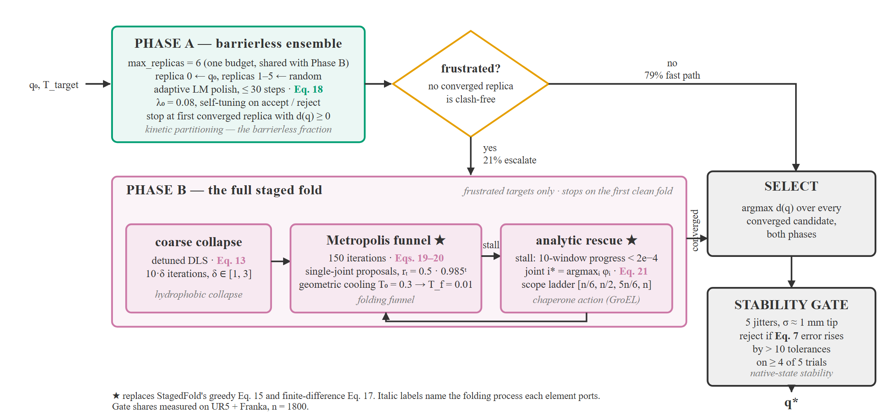
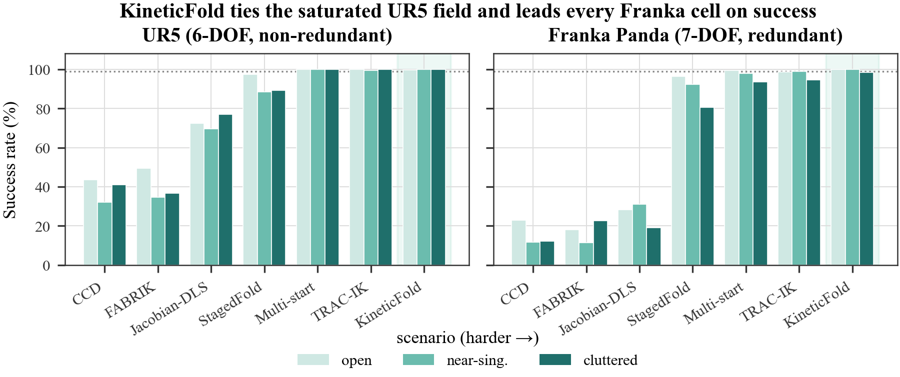
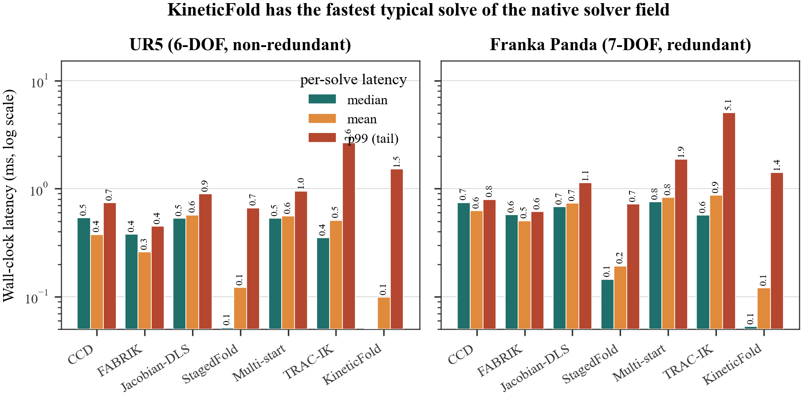
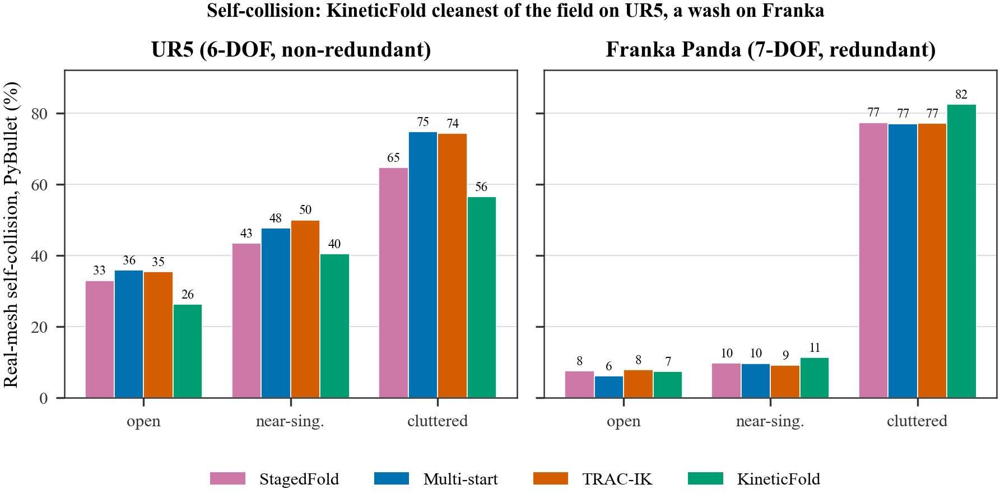

# ProteinIK: Inverse Kinematics as a Protein-Folding Process

## Abstract

Inverse kinematics (IK) and protein folding are structurally the same search problem: a chain of rigid segments whose only
free variables are the rotations between neighbouring segments, searching a rugged, constrained landscape for a
configuration that satisfies its boundary conditions. We take this correspondence literally and construct an IK solver
from the _process_ that proteins use to fold. StagedFold ports folding's ordered stages — local settling before the
target is consulted, coarse collapse, a funnelled narrowing search, a scoped chaperone rescue, and a native-state
stability check — into an IK algorithm. Its individual moves are standard IK; the folding-inspired _sequence_, together
with two moves that are unusual in this setting (a target-blind first stage and a scoped-then-escalating rescue),
constitute the contribution. StagedFold outperforms simple classical baselines but plateaus below production solvers.
KineticFold adds folding's _kinetic partitioning_ as a compute schedule, attempting a cheap
downhill fold first and paying for the full staged search only on genuinely frustrated targets. Against a baseline
field spanning the IK literature (Jacobian-DLS, CCD, FABRIK, TRAC-IK, Multi-start), KineticFold ties the top tier on
the UR5 and planar arms, where the top tier saturates at 99.3–100%, and outright leads every cell of the redundant
Franka, where it is the only solver above 98% on all three scenarios (98.3–100%) and beats the best baseline by
3.7 points on the hardest cell. With every solver compiled to native code, it is also the fastest of the field on both
arms — mean 0.1–0.7 ms, roughly 1.7–7× under TRAC-IK and Multi-start — and a latency tail within a few milliseconds
(worst p99 4.7 ms, below TRAC-IK's 5.1 ms). On self-collision KineticFold is the cleanest of the field on the
non-redundant arm, a ranking rather than an absolute, while on the redundant Franka a spare joint lets every method
dodge and the edge does not carry over.
Our results are validated against two independent physics simulators (PyBullet and MuJoCo): our forward kinematics agree
with both to within a micron, and both engines corroborate — and shrink — our self-collision
claims. The advantage is largest where the arm is most protein-like: on a planar arm lengthened from 4 to 16 joints,
KineticFold's single-shot clean-solve rate — target reached and self-collision-free — leads both production baselines
at every chain length, and the margin widens as the chain grows, reaching 10.4× over TRAC-IK and 3.5× over Multi-start
at sixteen joints (`n = 1000` per cell, 5000 at sixteen; Fisher exact `p < 0.05` in every cell). A restart oracle
confirms that clean folds remain available across that range, so the widening margin measures the growing difficulty of
_finding_ a clean fold rather than its disappearance.

## Keywords

Inverse kinematics; protein folding; kinetic partitioning; self-collision avoidance; simulated annealing; redundant
manipulators; dual-simulator geometric validation.

## 1. Introduction

Inverse kinematics — finding the joint angles that place a robot's end effector at a target pose — is deceptively hard.
The map from configuration to pose is nonlinear; a target may admit many solutions or none; the Jacobian loses rank at
singularities; and a redundant or long arm can reach the target while folding into itself. Classical solvers confront
this as a single optimization to be minimized from the first iteration, whether by damped least squares, cyclic
coordinate descent, reaching heuristics, or restart-based search, driving pose error down from the first iteration.

This is the same search a protein performs when it folds. A protein backbone is a chain of rigid bonds whose only soft
degrees of freedom are the dihedral rotations between residues; a robot arm is a chain of rigid links whose only
degrees of freedom are the joint angles. A protein reaches its native state by descending a rugged free-energy
landscape riddled with local minima, kinetic traps, and steric (self-overlap) constraints; an IK solver searches a
landscape with local minima, singular regions, and self-collision basins. The correspondence is not a loose analogy but
a structural isomorphism (Table 1): the two problems share their variables, their constraints, and the shape of the
space they search. We make this precise in Section 3.1.

**Table 1.** The folding / inverse-kinematics isomorphism.

| Protein folding                              | Inverse kinematics                   |
| -------------------------------------------- | ------------------------------------ |
| Backbone dihedral angles φ/ψ (soft DOF)      | Joint angles `q` (the DOF)           |
| Rigid bonds / fixed bond lengths             | Fixed link lengths (FK constraints)  |
| Native (folded) state                        | The IK solution configuration        |
| Free-energy funnel                           | Convergence basin to the target      |
| Rugged landscape / kinetic traps             | Local minima / failed solves         |
| Excluded volume (sterics)                    | Self-collision avoidance             |
| Hydrophobic collapse                         | Coarse approach to the target region |
| Secondary structure (local order)            | Local joint settling                 |
| Molecular chaperone (GroEL)                  | Restart / rescue from a stuck state  |
| Kinetic partitioning (fast vs. slow folders) | Easy vs. hard targets                |

Algorithms already pass between the two fields: cyclic coordinate descent, a robotics IK method, was adopted into
structural biology for protein loop closure [1]. Each carries a single piece of machinery across. This paper
carries the folding _process_ itself — the ordered sequence nature uses to fold, not one of its steps — and makes it
the engine of an IK solver. Section 2 catalogs the prior crossings and their direction.

The thesis is as follows. Inverse kinematics is structurally a protein-folding problem, so an IK solver built from
folding's process should win exactly where the problem becomes most folding-like. We defend this claim with two
solvers of increasing biological literalness, evaluated entirely in simulation across three manipulators and three
scenario families, with both physical arms independently scored on two physics engines.

The contributions of this paper are:

1. **A design principle** that casts IK as a folding _process_ — to our knowledge the first IK solver organized as a
   staged fold with kinetic partitioning and chaperone rescue. The novelty is the _organization_, together with two
   moves unusual in this setting (target-blind-first initialization and scoped-then-escalating rescue); every numerical
   ingredient is standard IK, so any advantage derives from the sequencing rather than from a new energy function.
2. **Two solvers instantiating the principle at increasing biological fidelity** — StagedFold (folding's ordered
   _sequence_) and KineticFold (kinetic partitioning as a _compute schedule_) — evaluated on three manipulators against
   a baseline field spanning the IK literature.
3. **A dual-simulator validation methodology** — "solve once, score three ways" (a capsule proxy plus PyBullet and
   MuJoCo) — that independently confirms our success claims on both physical arms and _corrects_ our own
   collision-magnitude claim.

Empirically, KineticFold ties the top tier on the UR5 and planar arms, where that tier saturates at 99.3–100%, and
leads every cell of the redundant Franka, where it
is the only solver above 98% across all three scenarios (98.3–100%); it is also the fastest of the field on both the
6-DOF and 7-DOF arms (mean 0.1–0.7 ms, roughly 1.7–7× under TRAC-IK and Multi-start) at a worst-case tail of 4.7 ms,
below TRAC-IK's 5.1 ms. On self-collision KineticFold is the cleanest of the field on the non-redundant arm,
while on the redundant arm a spare joint lets every method dodge and the edge does not carry over.

Those results establish that the principle is competitive with production IK; the result that tests the thesis is a
scaling one. As a planar arm is lengthened from 4 to 16 joints — made progressively more polymer-like — KineticFold's
single-shot clean-solve rate (target reached and self-collision-free) leads both production baselines at every chain
length, and the margin widens as the chain grows: monotonically from 2.0× to 10.4× over genuine TRAC-IK, and from 1.7×
to 3.5–4.5× over genuine Multi-start, between 4 and 16 joints (`n = 1000` per cell, 5000 at 16; Fisher exact
`p < 0.05` in every cell). The falling absolute rates are a search limit rather than a geometric one — a restart oracle
still demonstrates a clean fold for 75–97% of targets across that range — so what widens is exactly the gap between
what the chain admits and what a restart-only search can find. At that point the correspondence stops being an analogy and becomes the mechanism: the
method wins because the problem _becomes_ folding.

## 2. Related Work

We review the field along the axis that matters for our argument — how each method behaves when the search stalls —
followed by the folding theory we port and the prior crossings between the two disciplines, which run in one direction
only.

**Jacobian- and optimization-based IK.** Velocity-level IK descends from resolved-motion-rate control, which maps
end-effector rates to joint rates through the Jacobian (pseudo)inverse [2]. The raw pseudoinverse is unbounded near
singularities, which damped least squares (DLS) regularizes with a damping term that trades a little accuracy for
stability [3], [4], with singularity proximity quantified by the manipulability measure √det(JJᵀ) [5]; the damping
itself is refined per singular value by selectively damped least squares [6]. Position-level solvers cast IK as nonlinear least squares and apply Levenberg–Marquardt [7], [8],
the optimization twin of DLS. All of these are single-trajectory local optimizers: they follow one gradient from one
seed and settle into whatever basin they start in, with no intrinsic mechanism to escape a local minimum. We include
Jacobian-DLS as a baseline and reuse a damped-least-squares step inside our own solvers.

**Sampling and restart IK.** Production solvers wrap a local core in global restarts. TRAC-IK [9] runs a joint-limited
Newton solver — an extension of KDL [10] — concurrently with an SQP optimizer and returns the first to converge; when
the Newton branch detects stagnation (no progress between successive iterates) it re-seeds from a fresh random
configuration. Multi-start applies the same idea in the open: it runs independent seeds until one
converges. Both are strong production methods, and both, when stuck, discard the accumulated partial solution and
restart globally. Analytical generators such as IKFast [11] sidestep iteration by emitting closed-form solutions, but
only for chains with special solvable structure; a redundant chain is handled only by fixing designated free joints
and sweeping them on a discretization, and the generated solver is tied to one chain and admits no additional cost
terms.
This global-restart-on-stall behaviour is precisely what our chaperone rescue replaces with a _scoped_ perturbation
(Section 3.2).

**Heuristic IK.** Geometric heuristics trade the Jacobian for cheap per-joint updates: CCD rotates one joint at a time
along the chain [12], and FABRIK reaches forward and backward along the links with no matrix inversion [13]. Both are
fast on easy targets and degrade on constrained ones; we include both as baselines.

**Learning-based IK.** A more recent line learns the IK map from data — IKFlow trains a normalizing flow to sample the
full multimodal solution set for a target pose [14], and generative graphical IK represents the chain as a
distance-geometric graph so that a single model transfers across manipulators [15]. Such methods trade an expensive
training phase for fast inference; they are orthogonal to our contribution, which is training-free and applies to a new
arm immediately.

**Annealing-based IK.** Physics supplies optimizers as well as biology. Simulated annealing — a Metropolis-style
acceptance criterion combined with a cooling schedule, so that a cost function is annealed toward its minimum rather
than quenched into the nearest one — is the canonical case [16], [17], and it has been applied directly to manipulator
IK [18]. KineticFold's Phase-B funnel is exactly such a search (Eqs. 19–20). The
distinction is the one that also separates us from the metaheuristics below: annealing supplies an acceptance rule for
a search already under way, whereas kinetic partitioning decides whether that search is entered at all, and the scoped
rescue decides how far to escalate once it stalls.

**Biology-inspired IK.** Metaheuristic solvers already borrow from biology, but they borrow a _search operator_ rather
than a folding _process_. Memetic IK combines population-based mutation and selection with local gradient refinement
[19], [20], and genetic-algorithm [21] and particle-swarm [22] variants import crossover/selection or flocking dynamics
as the rule that proposes the next joint configuration. In every case biology supplies only the update operator; none
organizes the solve as a staged fold with a chaperone rescue gated by kinetic partitioning.

**Folding theory.** The native state is the sequence-encoded free-energy minimum [23], and it cannot be reached by
exhaustive conformational search [24]; it is reached instead by biased descent down a rugged but funnel-shaped,
minimally frustrated landscape [25], [26], [27], [28] — the direct analog of a well-shaped IK cost basin. We port two
mechanisms from this theory and mark a third as a direction for future work: _kinetic partitioning_, in which some
molecules fold directly while the rest are kinetically trapped and fold slowly [29] (KineticFold's compute schedule,
Section 3.3); _iterative-annealing chaperone action_, in which GroEL rescues trapped chains by repeated partial
unfolding and refolding [30], [31] (StagedFold's scoped rescue, Section 3.2); and _coarse-grained off-lattice bead
models_ [32], with hydrophobic collapse as the compaction drive [33], the basis for a solver that takes the
correspondence to its literal physical limit (Section 6).

**Prior crossings between the two fields.** The two fields already share machinery. CCD, a robotics IK
algorithm, was imported wholesale into structural biology for protein loop closure [1]; loop closure has likewise been
solved as an analytical kinematics problem [34], building on classical chain-closure geometry [35]; robot motion
planning has been used to map folding landscapes [36]; and a protein backbone is routinely modeled as a kinematic
linkage whose revolute joints are its dihedral angles [37], [38]. Every one of these crossings of algorithmic
machinery runs robotics → biology.
To our knowledge, the reverse — using the folding _process itself_ (funnels, chaperones, kinetic partitioning) as the
computational engine of a robot-arm IK solver — has not been attempted.

## 3. Methodology

This section states the folding/IK correspondence as a formal search problem
(Section 3.1), then builds two solvers of increasing fidelity to folding's process on top of it: StagedFold, which
ports folding's ordered _sequence_ (Section 3.2); and KineticFold, which ports folding's _compute schedule_
(Section 3.3).

### 3.1 Problem formulation: IK as a folding search

We state the correspondence of Table 1 formally, as the single object every solver in this paper — baseline and
folding-inspired alike — searches over.

**Configuration and forward kinematics.** A robot with `n` revolute joints has configuration `q ∈ ℝⁿ`, bounded
componentwise by joint limits `q ∈ [q⁻, q⁺]`. Forward kinematics composes one rigid transform per joint. In the
standard Denavit–Hartenberg (DH) convention [39] (UR5, planar arm):

```
Eq. (1)      Tᵢ(θᵢ) = Rot_z(θᵢ) · Trans_z(dᵢ) · Trans_x(aᵢ) · Rot_x(αᵢ)
```

with `θᵢ = qᵢ + θ_offset,ᵢ`. The Franka arm's official table is published in the _modified_ (Craig) convention [40],
which
reorders the same four elementary transforms — `Tᵢ = Rot_x(αᵢ₋₁) · Trans_x(aᵢ₋₁) · Rot_z(θᵢ) · Trans_z(dᵢ)` — and is
not interchangeable with Eq. (1): feeding a modified-DH table through the standard-DH transform silently yields a
different, wrong robot (Section 4.1). Either convention composes into
the full chain and the end-effector pose

```
Eq. (2)      T(q) = T₁(q₁) · T₂(q₂) ··· Tₙ(qₙ),         p(q) = T(q)[1:3, 4],   R(q) = T(q)[1:3, 1:3]
```

The associated geometric Jacobian `J(q) ∈ ℝ⁶ˣⁿ`, the instantaneous map from joint velocities to end-effector twist,
has columns

```
Eq. (3)      J_{v,i} = zᵢ × (p_end − pᵢ),     J_{w,i} = zᵢ
```

where `zᵢ` is joint `i`'s rotation axis and `pᵢ` its origin, both read off the chain in Eq. (2) (which frame carries
`zᵢ` depends on the DH convention, per the reordering above).

**The task.** Given a target pose `T_target ∈ SE(3)`, the pose error is the 6-vector

```
Eq. (4)      e(q) = [Δp; Δω],     Δp = p_target − p(q),     Δω = Log_SO(3)( R_target · R(q)ᵀ )
```

where `Log_SO(3)` extracts the axis–angle rotation vector of a rotation matrix (`Δω = θ·axis`, with
`θ = arccos((tr(R_err) − 1)/2)`, `axis` read off the skew-symmetric part of `R_err`, and `Δω = 0` when `θ` is
numerically zero). A configuration is a _success_ if `‖Δp‖ < 1 mm` and `‖Δω‖ < 10 mrad`.

**The steric constraint.** Every link occupies volume, and the chain must not intersect itself. We quantify this with a
signed clearance

```
Eq. (5)      d(q) = min_{(i,j): |i−j| ≥ 2}  [ dist_seg( ℓᵢ(q), ℓⱼ(q) ) − (rᵢ + rⱼ) ]
```

where `ℓᵢ(q)` is the line segment between joint origins `pᵢ` and `pᵢ₊₁` (the capsule core of link `i`), `rᵢ` its
radius, and `dist_seg` the standard closest-point-between-segments distance [41], evaluated over every _non-adjacent_
link pair, since adjacent links share a joint and are never meaningfully colliding. A pair is skipped when every link bridging it is zero-length, so that one segment's
endpoint coincides with the other's start: their segment distance is then identically zero and the pair would register
a permanent false contact (the Franka table contains such links; two of its fifteen non-adjacent pairs are suppressed
this way). `d(q) ≥ 0` means the arm clears
itself; `d(q) < 0` means interpenetration. A solve is _clean_ if it is both a success and satisfies `d(q) ≥ 0`. This
proxy is deliberately cheap — fast enough to sit inside an inner optimization loop — and, as Section 5.6 shows, it is
_optimistic_ relative to true mesh geometry. We therefore quote it as an absolute rate only where the capsules _are_ the
geometry (the synthetic planar chains, Sections 5.3–5.4); on the two physical arms it is used only as a same-tool
comparison across solvers, cross-checked against two independent full-mesh physics engines.

**The landscape.** Every solver in this paper, from single-trajectory Jacobian-DLS to our own, searches a combined
objective

```
Eq. (6)      E(q) = E_target(q) + E_limit(q) + E_collision(q) + …
```

(the exact terms and weights differ slightly by solver; Sections 3.2–3.3 give each one precisely, in closed form, down
to the calibrated constants). This objective is not convex: it has local minima wherever a joint configuration locally
reduces pose error without reaching the target, singular regions where `J(q)` loses rank and the local gradient stops
being informative, and collision-forbidden regions carved out by `d(q) < 0`. This is, structurally, a protein's
free-energy landscape — a rugged surface over the torsional degrees of freedom of a chain, punctuated by kinetic traps
and forbidden by excluded volume, — structurally the folding landscape of Section 2. Table 1's mapping is exact on this object: joint angles are dihedral
angles, link-length constraints are bond-length constraints, the target-reaching basin is the folding funnel,
self-collision is steric exclusion, and a stuck search is a kinetically trapped molecule, rescued the way a chaperone
rescues a misfolded chain.

The _order_ in which a solver visits this landscape, and the _schedule_ by which it decides how much of it to search,
are organized the way folding organizes them. The next two subsections build solvers of increasing fidelity to that
process.

### 3.2 StagedFold: the folding process as an algorithm

Every classical IK method reviewed in Section 2 treats the arm as a single objective to be minimized from the first
iteration. StagedFold instead runs the arm through the same _ordered stages_ a protein visits while folding: settle
locally without consulting the target, collapse coarsely toward the target region, run a funnelled search that narrows
in, invoke a scoped chaperone if the search stalls, and finally verify that the solution is _stable_ rather than
balanced on a knife-edge. Two moves are, to our knowledge, new in this context: a target-blind first stage, and a
rescue that starts scoped and escalates to a global reseed only as a last resort. StagedFold's defaults:
`max_iters = 200`, `pos_tol = 1e-3`, `orient_tol = 1e-2`; the tolerances are shared by every solver in the study.

Every stage draws on five energy primitives, given once here in closed form (weights `wₓ` are set per stage below):

```
Eq. (7)   E_target(q)    = ‖Δp‖ + 0.3·‖Δω‖                                              (Eq. 4's e(q))

Eq. (8)   E_limit(q)     = 50 · Σᵢ pᵢ(fᵢ),      fᵢ = (qᵢ − loᵢ) / (hiᵢ − loᵢ)   (fractional position in [0,1])
                            pᵢ(f) = (margin − f)²        if f < margin
                            pᵢ(f) = (f − (1 − margin))²  if f > 1 − margin,     margin = 0.05
                            pᵢ(f) = 0                    otherwise

Eq. (9)   E_collision(q) = 100 + 100·|d(q)|                        if d(q) ≤ 0
                            10 · ((0.05 − d(q)) / 0.05)²            if 0 < d(q) < 0.05
                            0                                       if d(q) ≥ 0.05

Eq. (10)  E_smooth(q)    = 0.5 · Σᵢ (qᵢ₊₁ − qᵢ)²

Eq. (11)  E_neutral(q)   = 0.5 · Σᵢ (qᵢ − q_neutral,ᵢ)²,     q_neutral = 0
```

`E_limit` and `E_collision` are soft barriers: both are zero in the safe interior and grow — quadratically near a
joint limit, quadratically then affinely
across the collision margin — rather than as a hard constraint, so gradient-based stages can still take a step near the
boundary instead of being blocked by it.

**3.2.1 Local-blind relaxation (secondary-structure analog).** Gradient-free coordinate descent, one joint at a time,
for six sweeps over the chain: for each `i`, try `qᵢ ± 0.3 rad` and keep whichever configuration lowers the
_target-blind_ local energy

```
Eq. (12)   E_blind(q) = E_neutral(q) + E_smooth(q) + E_limit(q)          (E_target never enters)
```

The purpose is to mirror local secondary structure forming before the global fold commits, seeding every later stage
from a relaxed, in-limits configuration rather than an arbitrary one.

**3.2.2 Coarse collapse (hydrophobic-collapse analog).** The first stage that consults the target: a deliberately
_detuned_ DLS pull on the full 6-D pose error, for 10 iterations,

```
Eq. (13)   Δq = Jᵀ (J Jᵀ + λ² I₆)⁻¹ e(q),      λ² = 0.15² = 0.0225,      q ← clip(q + 0.4·Δq)
```

This moves the hand into the neighbourhood of the target without attempting precision — the computational analog of a
protein collapsing to a compact molten globule before its final contacts form. Eq. (13) is the standard DLS update [3], [4] — the damped
counterpart of the Levenberg–Marquardt baseline of Section 2 — run here with loose damping and a 0.4 step scale.

**3.2.3 Funnelled narrowing search (folding-funnel analog).** The main refinement stage, run until the shared
iteration budget `max_iters = 200` is exhausted, alternates (a) a gradient-free, coordinate-wise stochastic local
search inside a shrinking radius and (b) one finer DLS gradient step, minimizing a fully weighted combined energy:

```
Eq. (14)   E_stage3(q) = 3.0·E_target(q) + 1.0·E_limit(q) + 2.0·E_collision(q) + 0.3·E_smooth(q)

Eq. (15)   qᵢ,try = clip( qᵢ + U(−rₜ, rₜ) ),      rₜ = 0.5 · 0.985ᵗ         (t resets at each rescue; fired every other iteration)
           accept qᵢ,try  iff  E_stage3(q_try) < E_stage3(q)               (greedy — no Metropolis test)

Eq. (16)   Δq = Jᵀ (J Jᵀ + 0.05² I₆)⁻¹ e(q)                                (finer DLS step, every iteration)
```

**3.2.4 Scoped chaperone rescue (chaperone-action analog).** A stall is detected by keeping a window of the
last 10 energy values and firing a rescue if progress over the window falls below `2e-4`. The misfolded joint is
identified by one-sided finite-difference sensitivity,

```
Eq. (17)   i* = argmaxᵢ | E_stage3(q + δ·eᵢ) − E_stage3(q) |,      δ = 0.05 rad
```

Rescue then re-randomizes a _contiguous window of joints_ centred on `i*`, on an escalation ladder of scopes
`[n/6, n/2, 5n/6, n]` (on the UR5: `[1, 3, 5, 6]`), leaving the rest of the already-settled chain untouched. Only the
final rung is a full random reseed of the whole chain. This is the precise contrast with TRAC-IK, whose stuck-detection
response is _always_ a full random restart (Section 2): StagedFold starts scoped and escalates toward global only as a
last resort, so on a persistently stuck target its behaviour converges to TRAC-IK's.

**3.2.5 Stability-gated termination (native-state stability analog).** Once the search converges, the candidate
solution `q*` is perturbed five times by `δqₖ ~ 𝒩(0, σ²I)`, with `σ` scaled by the arm's reach so the expected tip
displacement is ≈1 mm on any robot, and rejected if the pose error of Eq. (7) rises more than ten success tolerances,
`10·(pos_tol + 0.3·orient_tol)`, above its converged value on four or more of the five trials. The margin is
deliberately loose: a well-conditioned solution moves with its perturbation, so the gate fires only under
order-of-magnitude amplification — the knife-edge case where `J(q*)` is near-singular along the perturbation and the
pose error holds only coincidentally. This mirrors the requirement that Anfinsen's native state be a _stable_
free-energy minimum, not merely _a_ minimum. The test reads pose error alone; clearance enters through Eq. (9) in the
search objective.

StagedFold clears the simple classical baselines (Jacobian-DLS, CCD, FABRIK) but does not exceed the strong production
baselines (TRAC-IK, Multi-start) on success (Section 5.1) — the gap KineticFold closes.

Three ablations isolate these choices. Replacing Stage 1's
neutral-pose anchor with a pure neighbour-coupling relaxation cost ≈4 points of cluttered success. Biasing Stage 3's
stochastic proposals with a rotamer-library prior improved mean clearance but cost 14–23 points of cluttered success.
An allostery-inspired compensating step traded ≈1 point of success for a small clearance gain.

### 3.3 KineticFold: kinetic partitioning as a compute schedule

**Diagnosis.** StagedFold's shortfall is not the average solve; it is the _tail_. On the always-run-every-stage fold, the slowest ≈10% of targets consumed ≈57% of total wall time. This rules out
micro-optimization as a fix: a bit-identical micro-pass over the same inner loop bought only 1.1–1.4×, because the cost
is not in _how_ the per-fold search runs but in _whether a target enters the expensive per-fold search at all_. The fix
must be structural, and folding already provides one.

**3.3.1 The barrierless-first ensemble.** Real proteins exhibit _kinetic partitioning_: some molecules fall straight
down a smooth funnel to the native state with no search at all, while the rest are kinetically trapped and fold
slowly [29], the population chaperones act on [30], [31]. KineticFold ports this as a _compute schedule_ rather than a
search heuristic. One constant, `max_replicas = 6`, bounds each phase's replica loop independently.



**Figure 1.** KineticFold's compute schedule; italic labels name the folding process each element ports. A single budget
of `max_replicas = 6` governs both phases. Phase A runs a cheap adaptive Levenberg–Marquardt polish (Eq. 18) from `q0`
and random seeds, stopping the moment one replica converges to a clash-free configuration — the barrierless fast path,
taken by 79% of targets across the two physical arms (`n = 1800`), from 93% on UR5 open-space down to 50% on Franka
cluttered, so the gate tracks scenario difficulty rather than firing at a fixed rate. A target is _frustrated_ only if
no converged Phase-A replica is clash-free; only then does Phase B fire, running the staged fold of Section 3.2 with two
substitutions (★): a Metropolis-accepted funnel under geometric cooling (Eqs. 19–20) in place of StagedFold's greedy
rule, and an analytic rescue that reads its joint off the already-computed Jacobian (Eq. 21) in place of
finite-difference probing. Both paths then merge: the returned configuration is the converged candidate with the largest
self-clearance, and it must clear the stability gate of Section 3.2.5.

_Phase A (barrierless)._ Each replica runs a cheap adaptive Levenberg–Marquardt polish (≤ 30 LM steps); replica 0 seeds
from `q0`, the rest from random configurations. Each LM step is a damped Gauss–Newton update whose damping `λ`
self-tunes from the step's own outcome, Newton-fast when it helps and conservative when it does not:

```
Eq. (18)   Δq = Jᵀ (J Jᵀ + λ² I₆)⁻¹ e(q),        q_try = clip(q + Δq)
           if  E_target(q_try) < E_target(q):  accept q ← q_try,   λ ← max(0.5λ, 1e-4)
           else:                                reject,             λ ← min(2.5λ, 2.0)     (λ₀ = 0.08)
```

with the polish terminating early once `‖Δp‖ < pos_tol ∧ ‖Δω‖ < orient_tol`, or once `λ ≥ 2.0` (a persistent overshoot
signals that this replica will not converge downhill). As soon as any replica converges to a sterically clean solution
(`d(q) ≥ 0`), Phase A stops early with a success; most targets never see anything more expensive than Eq. (18). The
_frustration criterion_: a target is declared _frustrated_ — and only then escalated — if and only if, after all
Phase-A replicas have run, no converged replica is clash-free.

_Phase B (the full staged fold)_ fires only on frustrated targets: a StagedFold-style fold (coarse collapse → funnel →
chaperone rescue, Sections 3.2.2–3.2.4), seeded as Phase A is — replica 0 from `q₀`, the rest from random
configurations — with two substitutions. First, its Stage 3 funnel is replaced
by a _true Metropolis-accepted_ search rather than StagedFold's greedy Eq. (15). Each single-joint
candidate `q_try` (one coordinate perturbed by `U(−rₜ, rₜ)`, same shrinking radius as Eq. 15) is accepted with
probability

```
Eq. (19)   P(accept) = 1                                                    if E(q_try) < E(q)
                        exp( −(E(q_try) − E(q)) / Tₜ )                      otherwise

Eq. (20)   Tₜ = T₀ · (T_f / T₀)^{t / max_iters},      T₀ = 0.3,   T_f = 0.01,   max_iters = 150
```

— this is simulated annealing (Section 2): the standard Metropolis criterion [42] under a geometric cooling schedule,
so the funnel search can climb out of
shallow local minima early (`Tₜ` large) and freezes into greedy descent as `t → max_iters` (`Tₜ` small). Phase B runs
on its own budget of 150 iterations, so Eq. (20)'s cooling and Eq. (15)'s radius decay are compressed relative to
StagedFold's 200.

Second, the rescue of Section 3.2.4 selects its joint analytically rather than by Eq. (17)'s finite difference. For
each joint we compare where the task pulls it — a Jacobian-transpose step toward the target — against where local
smoothness pulls it, the average of its neighbours:

```
Eq. (21)   φᵢ(q) = | q_local,ᵢ − (q + Jᵀ e(q))ᵢ |,      q_local,ᵢ = ½(qᵢ₋₁ + qᵢ₊₁)
```

(at the ends, `q_local` is the single neighbour). The rescue window is centred on `argmaxᵢ φᵢ`, the joint whose local
and global demands disagree most — frustration in the landscape sense of Section 2: locally settled, globally required
to move. `φ` costs one forward-kinematics pass regardless of DOF, whereas Eq. (17) spends one per joint.

Phase B's coarse collapse runs Eq. (13) for `10·δ` iterations, where the contact-order-inspired factor
`δ = 1 + min(reach/reach_max, 1) + min(κ(J(q₀))/100, 1) ∈ [1, 3]` scales the budget with how far the target sits and
how poorly conditioned the arm is there. Once the search reaches `‖Δp‖ < 0.05 ∧ ‖Δω‖ < 0.2` the funnel step is replaced
in-loop by a short LM polish (Eq. 18's rule, capped at 12 steps), and Phase B stops on the first clean fold or after at
most two collision-aware converged folds. Attempting spontaneous folding first and invoking the chaperone only on
failure is how GroEL operates [31]. Both phases feed one pool of converged candidates; the returned configuration is
the one with the largest self-clearance `d(q)`, and it must clear the stability gate of Section 3.2.5.

**3.3.2 The schedule, not the inner loop.** The reported latencies come from a C++/Eigen port whose inner loop carries
no optimization beyond fusing pose and Jacobian into a single forward-kinematics pass: each Metropolis candidate is
scored by a full chain rebuild. That this port is nonetheless the fastest solver on both physical arms (Section 5.2) is the
schedule's doing rather than the inner loop's. The Python reference additionally caches chain prefixes and rebuilds
only the _suffix_ that a single-joint perturbation invalidates, verified bit-identical against the reference kinematics
on the UR5 and the planar arm (500 configurations each); extending that check to Franka is an open item.

Naive tail-edits that preserve the fold order but simply spend less — capping replicas, bailing earlier, fewer
per-stage iterations — bought little speed and eliminated the headline result: at `cap_replicas = 2`, Franka open-space
success falls to 71.7%, against the ≈100% the default schedule reaches (Section 5.1). The cost that matters is the
_per-fold_ search, not the _number_ of folds attempted, which is why the kinetic-partitioning gate (skip the expensive
search entirely when unfrustrated) is the
correct lever and a naive budget cut is not.

## 4. Experimental Setup

We test three arms of increasing kinematic hardness, three target scenarios of increasing difficulty, and a field of
six baselines spanning the IK literature of Section 2 — five general-purpose, plus an exact analytical solver that
applies only to the planar arm. Every solver sees exactly the same targets, and every solver's final configuration on the two physical arms is
independently re-scored by two full physics engines it never queried during solving; the planar chain carries no
manufacturer URDF, so its collision column is the capsule model of Eq. (5). This section fixes every parameter
of that protocol; all quantitative results are traceable to a named committed benchmark run.

### 4.1 Robots

**Table 2.** Robots.

| Arm                | DOF | Notes                                                                                                                                                                                                                                                                                                                                                                                                                                                                          |
| ------------------ | --- | ------------------------------------------------------------------------------------------------------------------------------------------------------------------------------------------------------------------------------------------------------------------------------------------------------------------------------------------------------------------------------------------------------------------------------------------------------------------------------ |
| Planar 3-DOF (RRR) | 3   | link lengths `[0.4, 0.3, 0.2]` m; has an exact closed-form IK solution — the ground-truth validator for every numerical solver                                                                                                                                                                                                                                                                                                                                                 |
| UR5                | 6   | non-redundant; standard-DH; the primary tuning and validation arm                                                                                                                                                                                                                                                                                                                                                                                                              |
| Franka Panda       | 7   | redundant; requires the modified/Craig DH convention (Eq. 1's reordering, Section 3.1); the standard-DH transform places the computed end-effector ≈1.4 m from the real robot; verified against the `panda_link8` frame in franka_ros's official URDF [43] via PyBullet (Section 4.6); tight, asymmetric joint limits, including joint 4 permanently confined to `[−3.07, −0.07]` rad (the elbow-down constraint) |

### 4.2 Scenarios (target generators)

Every scenario draws a joint configuration uniformly from the joint limits and forward-kinematics it into a Cartesian
target, so every target is reachable by construction:

```
Eq. (22)   q_cfg ~ U(q⁻, q⁺),      T_target = T(q_cfg)                         (Eq. 2's FK)
```

`open_space` uses Eq. (22) directly, with an independent fresh draw of the same form for the start configuration `q0`;
no geometric relationship between `q0` and the target is imposed, and no rejection sampling is applied. This is the
baseline difficulty distribution, and on its own it already yields configurations that are ≈30% near-singular on the
UR5 and ≈27% on Franka by the manipulability measure below; the planar arm's uniform draw almost never is (≈0.5%), so
`near_singular` is the scenario that separates the two physical arms.

`near_singular` and `cluttered` instead reject-sample Eq. (22) against a hardness criterion, keeping the best-scoring
draw seen if no draw clears the threshold within the try budget. The hardness criterion for `near_singular` is the
Yoshikawa manipulability index [5],

```
Eq. (23)   m(q) = √det( J(q) J(q)ᵀ )
```

evaluated on the full `6×n` Jacobian of Eq. (3) for UR5 and Franka, or on the reduced `3×n` planar sub-Jacobian
(x-velocity, y-velocity, z-angular-velocity rows) for the planar arm, whose full 6-row Jacobian is rank-deficient by
construction. A configuration is accepted once `m(q) < τ_ms`, per arm (Table 3), within `max_tries = 50`.

`cluttered` rejects on the self-collision clearance of Eq. (5) instead, accepting once `d(q) < −0.03` within
`max_tries = 200`. The `−0.03` m threshold is calibrated against the arm's own clearance distribution: over random UR5
configurations the median min-self-distance is ≈0.020 m and the 5th percentile ≈−0.054 m, so `−0.03` m admits
approximately the worst-clearance decile rather than the typical draw.

**Table 3.** Scenario hardness thresholds.

| Scenario        | Criterion              | Threshold                                  | `max_tries`      |
| --------------- | ---------------------- | ------------------------------------------ | ---------------- |
| `open_space`    | none                   | —                                          | 1 (no rejection) |
| `near_singular` | `m(q) < τ_ms` (Eq. 23) | planar: 0.001 · UR5: 0.005 · Franka: 0.015 | 50               |
| `cluttered`     | `d(q) < −0.03` (Eq. 5) | −0.03 m (all arms)                         | 200              |

### 4.3 Baselines

Every baseline is either a genuine upstream library or a native port of the in-repo algorithm, each built on the shared
kinematics of Section 3.1 (Eqs. 2–4). Table 4 gives each solver's implementation and configuration as benchmarked.

**Table 4.** Baseline hyperparameters.

| Solver                   | Implementation (genuine / native)                                                                                     | Iteration budget             | Restarts / population              | Stagnation response                   |
| ------------------------ | ------------------------------------------------------------------------------------------------------------------- | ---------------------------- | ---------------------------------- | ------------------------------------- |
| Jacobian-DLS             | Robotics Toolbox `ik_LM` (Corke) [44], single-shot from `q0`                                                             | `ilimit = 200`, `slimit = 1` | none                               | none — single trajectory              |
| CCD [12]                 | native C++/Eigen port; one-joint base→tip rotation; wrist joints (`min(3, max(1, n//2))`) blend a 0.5×-weighted orientation term | `max_iters = 300` full sweeps | n/a                               | none                                  |
| FABRIK [13]              | native C++/Eigen port; forward/backward reaching; wrist orientation nudged 0.6× before each position pass            | `max_iters = 150`            | n/a                                | none                                  |
| TRAC-IK [9]              | genuine TRACLabs C++/KDL/NLopt (`tracikpy`), `solve_type = Speed`; manufacturer URDF on UR5/Franka with the DH-frame target mapped through the validated constant frame offset (Section 4.6), DH-generated URDF on the planar arm | 5 ms timeout, `ε = 1e-5`     | concurrent KDL-Newton + NLopt-SQP  | library-native random reseed on stall |
| Multi-start              | Robotics Toolbox `ik_LM` (Corke) from random seeds                                                                  | `ilimit = 30` per search     | up to `slimit = 100` restarts      | first converged search                |
| Analytical (planar only) | closed-form trigonometric IK                                                                                        | exact                        | —                                  | —                                     |

**Implementation and environment.** Every solver in the study runs as native compiled code, so the latency comparison of
Section 5.2 is apples-to-apples. The ProteinIK family (StagedFold, KineticFold) and the two geometric
baselines (CCD, FABRIK) are C++/Eigen ports of the in-repo algorithms, exposed through a `pybind11` module
(`pik_native`) and FK-/energy-parity-checked against the reference DH implementation to ≤1e-11; the remaining baselines
are genuine upstream libraries called through thin adapters — TRAC-IK via `tracikpy` (TRACLabs C++/KDL/NLopt), and
Jacobian-DLS and Multi-start via the Robotics Toolbox (`ik_LM`). Each solver builds its own kinematic chain from the
identical DH `RobotSpec` (FK-parity-checked against our own forward kinematics), and every metric is recomputed with the
repo's own DH machinery, so the columns stay comparable across native and library solvers. All benchmarks were run under
Ubuntu 22.04 on WSL1 (kernel 4.4.0-19041-Microsoft), Python 3.10, with `tracikpy`, `roboticstoolbox` 1.3.1, `PyKDL` 1.5.1, `pybullet`, and `mujoco`
3.10.0 (NumPy pinned `<2` for the tracikpy ABI).

### 4.4 Protocol and fairness

**Scale.** Two sweeps underlie the results, each supplying the measures it is best suited to. Success and latency come
from a survey at `seeds = [1, 2, 3]` (`n = 300` per cell) spanning all three arms, which every solver runs end to end.
Real-mesh collision comes from a dedicated sweep at `seeds = [1..10]` (`n = 1000` per cell) on the two physical arms.
The split follows the measurements' own stability: across the solver field, collision moves about twice as much between
the two draws as success does (mean 2.1 against 1.2 percentage points per cell, worst 6.6 against 4.0), so collision is
the measure that earns the extra seeds, while the 3-seed survey is the one that carries the planar arm the 10-seed
sweep omits.

**Shared targets.** Within a cell, targets are drawn once per seed from `rng = default_rng(seed)` before the solver loop
begins, and the resulting target list is handed unchanged to every solver in that cell, so no solver ever sees an easier
draw than another. Per-trial solver RNG is decoupled and reproducible (`default_rng(seed * 1_000_003 + i)` for trial
`i`).

**Warm-up.** Each cell runs `warmup = 8` untimed solves before timing starts, on that seed's first eight targets, driven by a
separate fixed generator (`default_rng(10_000 + w)`) that leaves the timed trials' per-trial stream untouched.

**Timing.** Wall-clock is measured with a monotonic counter bracketing only the solver's iteration loop; target
generation and warm-up are excluded. Latency percentiles (p50/p95/p99) are computed on the _pooled_ set of timings
across all seeds in a cell, not averaged per seed and then combined, so the tail statistics reflect the full trial
population.

### 4.5 Metrics

For every trial we record: success (`‖Δp‖ < 1 mm ∧ ‖Δω‖ < 10 mrad`, Eq. 4); wall-clock latency (mean and p50/p95/p99,
the tail being a first-class metric); self-collision (`d(q) < 0`, Eq. 5) and mean clearance; joint-limit violations;
and restart count. A solve is _clean_ if and only if it is a success and collision-free.

### 4.6 Validation harness: solve once, score three ways

Every solver's final configuration `q*` from every trial on the two physical arms is re-scored independently by two
full-mesh physics engines it never queried while solving: PyBullet [45] and MuJoCo [46], both loading the same URDF (resolved via the
robot_descriptions package [47] — the standard UR5 description and Franka's official franka_ros URDF [43]; MuJoCo loads
it through a URDF-to-MJCF-compatible rewrite that preserves fixed-joint links as separate bodies rather than fusing
them). Both queries are purely kinematic — PyBullet via `resetJointState` + `getLinkState`,
MuJoCo via a direct `qpos` write followed by `mj_kinematics` — so neither engine steps a physics simulation or resolves
contacts dynamically. Each is asked only where the links are at a given configuration and how close the non-adjacent
ones come. This makes the comparison apples-to-apples with our own DH-based FK and capsule proxy: three independent
geometric queries against the identical model, not a dynamics rollout against a kinematic one.

_FK agreement._ At backend construction we assert that our DH FK matches each engine to a residual `< 1e-4` m/rad;
measured residuals are far tighter (UR5 DH↔PyBullet `9.5e-7`, DH↔MuJoCo `4.2e-8`; Franka DH↔PyBullet `6.6e-7`,
DH↔MuJoCo `8.7e-16`; PyBullet↔MuJoCo agree to ≈4–6e-8 m on both arms), so every success claim on these two arms holds
independently on two engines, including the modified-DH Franka kinematics of Section 4.1.

_Collision agreement._ Over `n = 3000` random configurations per arm, we compute the proxy clearance and both
engines' closest-point distances, then measure

```
Eq. (24)   sign-agree(A, B) = 100 · mean( [d_A(q) < 0] = [d_B(q) < 0] )     over n random q
Eq. (25)   corr(A, B)       = Pearson( d_A(q), d_B(q) )                     over n random q
```

for every engine pair. PyBullet and MuJoCo agree on the sign call 97.8% (UR5) to 99.0% (Franka) of the time with
correlation 0.88 (Franka) to 0.99 (UR5) on raw signed distance. The two independent oracles corroborate each other, so
a proxy-vs-oracle disagreement (Section 5.6) can be attributed to the proxy, not to noise between the oracles.

## 5. Results and Discussion

All numbers in this section come from the two sweeps of Section 4.4 — the 3-seed survey (`n = 300` per cell, all three
arms) for success and latency, and the 10-seed sweep (`n = 1000` per cell, UR5 and Franka) for real-mesh collision —
with every figure and table naming its own source. The DOF-scaling results come from a separate sweep on planar N-DOF
arms (Section 5.4, `n = 1000` per cell over seeds 1–10); Section 5.5's clean-goal rates combine survey success with
10-seed collision.

### 5.1 Success: a saturated tie on UR5, a clear KineticFold lead on Franka

Success is the most basic thing an IK solver must do — place the end effector within 1 mm and 10 mrad of the target
pose in a single solve (Eq. 4) — and it is where the field splits cleanly into two tiers. Figure 2 shows the
single-shot rate for every solver on the two physical arms; the two paragraphs below read it bottom tier first.



**Figure 2.** Single-shot success rate (%) for every solver on UR5 (left) and Franka Panda (right), bars grouped by
scenario on a difficulty ramp (light = `open_space` → dark = `cluttered`); the dotted line marks 99%. The two-tier
structure the paper argues for is immediate: the simple, single-trajectory baselines (CCD, FABRIK, Jacobian-DLS)
collapse on the harder scenarios, StagedFold trails the production field, and the production baselines and KineticFold
hold near ~100% on UR5 — with KineticFold alone staying above 98% on every Franka cell too. All values are from the
3-seed survey (`n = 300` per cell).

The **lower tier** is the simple, single-trajectory baselines (Jacobian-DLS, CCD, FABRIK). They collapse under both
arms' harder scenarios — all three stay below 32% on Franka (CCD falls 23.0 → 12.3% from `open_space` to
`cluttered`), and on UR5 only Jacobian-DLS, as a genuine Robotics-Toolbox LM solver, reaches ~70–77%, with CCD and
FABRIK below 50% — exactly the single-basin-descent failure mode Section 2 predicts for methods with no restart
mechanism. The two restart-capable production baselines recover most of that ground: TRAC-IK and Multi-start hold
99–100% across UR5 and slip on Franka, to 94.7% and 93.7% on its `cluttered` cell. StagedFold —
folding's _process_ without its _compute schedule_ — clears every simple baseline yet trails those two
production baselines on the same hard cells (80.7% on Franka `cluttered`), the verdict anticipated in Section 3.2:
process alone plateaus below production methods.

The **upper tier** is KineticFold. It solves 99.7 / 100 / 100% of UR5
`open_space` / `near_singular` / `cluttered` targets and 100 / 100 / 98.3% on Franka. On UR5 this is a saturated
tie with the strengthened production field (Multi-start 100 / 100 / 100, TRAC-IK 100 / 99.3 / 100): with genuine
implementations these baselines sit at the ceiling too, so the easy arm does not separate the
top of the field. Where KineticFold pulls clear is Franka: it is the only solver that stays above 98% on every cell,
and its worst case — 98.3% on Franka `cluttered` — tops the best baseline there (TRAC-IK, 94.7%) by 3.7
points, and Multi-start (93.7%) by 4.7. This is the gap kinetic partitioning buys over StagedFold's staged
fold: the same folding machinery, re-scheduled, turns a plateau below the production baselines into a lead over them
where the arm is hard.

A third arm reproduces the same ordering. The planar 3-DOF arm — which carries an exact closed-form solution and so
serves as the study's ground-truth validator (Table 2) — was run through the identical success sweep, and shows the
two-tier structure just as sharply: on `cluttered` KineticFold solves 100% of targets while CCD and FABRIK fall to
≈22–24% and Jacobian-DLS to 68%, and the restart-capable production baselines stay with it (TRAC-IK and Multi-start
both 100%). It is kept out of Figures 2–4 because it carries no manufacturer URDF and so has no real-mesh oracle: its
self-collision is scored instead against the capsule model of Eq. (5), which for a chain whose geometry those capsules
define is exact rather than approximate (Section 5.4). Section 5.3 reports that scoring; Section 5.4 lengthens the same
chain toward a polymer.

### 5.2 Speed: KineticFold is the fastest solver on the two physical arms

Figure 3 reports each solver's median, mean, and p99-tail per-solve latency on both arms in the open-space regime, where every
solver is timed on targets it genuinely attempts; reported together, the three statistics separate a solver's typical
cost from the right-skew — and the tail — its occasional slow solves introduce.



**Figure 3.** Per-solve wall-clock latency (log scale) for every solver on UR5 (left) and Franka Panda (right) in the
open-space regime; each solver shows its median (teal), mean (orange), and p99 tail (red), with the millisecond value
on each bar. Every solver is now native compiled code — TRAC-IK (TRACLabs C++), the Robotics-Toolbox baselines,
and the C++/Eigen ProteinIK and CCD/FABRIK ports — so the comparison is apples-to-apples. KineticFold has the fastest
typical solve of the field on both arms and the smallest tail among the fast solvers. Latency is from the 3-seed
survey (`n = 300` per cell), the same file as success.

With every solver compiled, the whole field now runs sub-millisecond, and KineticFold is the fastest of it on both arms:
mean 0.1 ms on each, ahead of TRAC-IK (0.5 and 0.9 ms), Multi-start (0.6 and 0.8 ms), and the
now-native CCD/FABRIK (0.3–0.6 ms). Its median sits near the measurement floor (≈0.04 ms on UR5), and — the point
the third bar makes — its tail is small: p99 1.5 ms on UR5 and 1.4 ms on Franka, both under TRAC-IK's 2.6 and
5.1 ms. This is the direct signature of Phase A's barrierless-first schedule (Section 3.3.1, Eq. 18): most targets fall
straight down the cheap LM polish and never enter the expensive staged fold.

The hardest cells concentrate what tail there is — the frustrated minority that escalates to Phase B is what the
p99 bar captures — and in native code that tail is a few milliseconds: KineticFold's worst p99 anywhere in the survey is
4.7 ms (Franka `cluttered`), below TRAC-IK's 5.1 ms there. The
barrierless-first schedule keeps the mean near the median, and compilation keeps the tail near the mean, so KineticFold
is real-time capable. All timings are wall-clock and carry OS scheduling noise on mean/p95/p99; success, collision,
and error columns are deterministic given the seed.

### 5.3 Self-collision: a KineticFold edge on UR5 and the planar chain, a wash on Franka

Because real-mesh collision is the seed-sensitive measure (Section 4.4), the two physical arms are compared only on the
dedicated 10-seed run (`n=1000`/cell, both PyBullet and MuJoCo), and only among the
solvers that clear ≈90% success — a collision rate is meaningful only for a solver that actually reaches the target.
Figure 4 reports it for both arms; the planar chain, which has no real-mesh oracle, follows them from the survey.



**Figure 4.** PyBullet real-mesh self-collision rate (%) by scenario for the high-success solvers, on
UR5 (left) and Franka Panda (right); MuJoCo agrees to within ≈1 point and preserves every ranking. On the non-redundant
UR5 KineticFold is the lowest bar of the field in every regime;
on the redundant Franka the field converges into a wash. Values are from the 10-seed run (`n = 1000` per cell).

**UR5 — a clear protein-solver win.** The two ProteinIK solvers are the two cleanest of the field. KineticFold has the
lowest real-mesh collision of _any_ solver in this study on all three scenarios and both engines (PyBullet
`open_space` 26.2%,
`near_singular` 40.4%, `cluttered` 56.4%), while matching the top of the success field (99.7 / 100 / 100). StagedFold is dirtier than KineticFold in every regime (64.6 vs. 56.4% on `cluttered`), on the identical target set. Against
TRAC-IK its collision rate runs 1.24–1.35× lower (26.2 vs. 35.3% on `open_space`,
40.4 vs. 49.9% on `near_singular`, 56.4 vs. 74.2% on `cluttered`), and its mean signed clearance over the cell is about half as
negative (−0.019 m vs. −0.037 m); the capsule proxy overstates that margin (Section 4.6). The
mechanism traces to Eq. (19)'s Metropolis funnel and the
collision term in Eq. (14): on frustrated targets, KineticFold's Phase-B search weights `E_collision` heavily
(coefficient 2.0 in Eq. 14, against 3.0 on the target term) and can escape shallow steric traps via thermal acceptance,
whereas TRAC-IK's response to a stall is a full random restart with no collision-directed search.

**Franka — a wash, for a structural reason.** On `open_space` and `near_singular` every solver sits in a narrow 6–11%
band with no consistent ordering; on `cluttered`, where the scenario actively forces self-collision, the field
converges into a ~77–82% band — the restart baselines (TRAC-IK 77.1%, Multi-start 77.0%) at
the low end with KineticFold (82.4%) a few points above them. Redundancy erases the edge: Franka's spare 7th joint gives
every method a null-space direction to dodge self-collision while still reaching the target, so the collision-directed
search that gives KineticFold its UR5 edge has much less room to matter once a spare joint already does the dodging. The
DOF-scaling experiment of Section 5.4 tests that relationship directly.

**Planar — the chain-constrained extreme.** The 3-DOF planar arm has no redundancy at all: three joints for a
three-parameter planar task, so a target reachable only through a folded pose admits no alternative that clears the
chain. Scored on the capsule model that defines its geometry (`n = 300` per cell, survey), the clean-solve rate — reach
the target and be collision-free — splits the field on the hardest cell. KineticFold returns 49.0 clean solves per 100
attempts against 27.7 for both TRAC-IK and Multi-start, a 1.77× margin (Fisher exact, `p < 1e-6`), and it is the only
solver above the ≈90% success bar whose mean clearance stays positive there (+0.018 m against −0.012 and −0.011 m). The
same ordering holds on `open_space` by a narrower 95.3 vs. 90.7 and 92.7; on `near_singular` all three tie at ≈50%, the
geometry admitting no clean solution for any of them to find. The margin is paid for in time rather than in success:
all three reach ~100% of these targets, and on the two hard cells KineticFold spends 0.29–0.30 ms per solve against
0.16–0.19 ms, the collision-directed search having to run on most targets once the chain has no spare joint to dodge
with.

Taken together, Sections 5.1–5.3 draw one consistent picture. On success the UR5 and planar arms saturate — the top
tier ties at 99.3–100% — and the field separates only on the redundant Franka, where KineticFold leads every cell,
including the two baselines it is built to exceed (TRAC-IK, Multi-start). Speed holds across both physical arms, now
that the field is all native: KineticFold is the fastest solver of the field on each. The collision edge tracks
redundancy rather than the arm — largest on the planar chain, which has no spare joint at all (1.77× the clean-solve
rate of either production baseline), clear on the non-redundant UR5, where KineticFold is the cleanest of the field
(1.24–1.35×) and the chain has nowhere to hide from its own search, and dissolved into a wash on the redundant Franka,
where a spare joint lets every solver dodge for free. That conditionality is independent evidence _for_ the mechanism claimed in Section 3.3: the edge comes
from collision-directed search finding routes a restart-only baseline cannot, and such routes matter most exactly when
the chain is most constrained.

### 5.4 Scaling with chain length

The correspondence predicts that the advantage should grow as the chain lengthens. On the planar arm we grow the joint
count from 4 to 16 in seven steps and measure the same single-shot clean-solve rate at `n = 1000` per cell (seeds
1–10 × 100 targets — the ten-seed protocol of Section 4.4, since clean-solve is collision-gated and collision is the
seed-sensitive measure). The sweep runs **both** production baselines, TRAC-IK and Multi-start, each as its genuine
upstream C++ library. The 16-joint cell is run at `n = 5000` instead: clean solves are rare events there, and 1000
trials could not separate KineticFold from Multi-start.

**Table 5.** Single-shot clean-solve rate (%) vs. degrees of freedom, planar arm.
All three solvers run as native compiled code: KineticFold as its C++/Eigen port, TRAC-IK as the genuine TRACLabs C++
library (`tracikpy`), and Multi-start as genuine Robotics Toolbox `ik_LM`, each solving the identical DH chain.

| DOF | n | KineticFold % [95% CI] | TRAC-IK % (range) | Multi-start % (range) | ×TI | ×MS | feasible % |
| --: | ---: | ---------------------: | ----------------: | --------------------: | --: | --: | ---------: |
|   4 | 1000 |  **74.80** [72.02, 77.39] |  37.54 (37.10–37.90) |   44.10 (43.10–45.00) | 2.0× | 1.7× |       89.9 |
|   6 | 1000 |  **61.10** [58.04, 64.07] |  24.92 (24.70–25.30) |   30.68 (28.70–32.00) | 2.5× | 1.9× |       94.6 |
|   8 | 1000 |  **40.10** [37.11, 43.17] |  11.00 (10.70–11.40) |   17.62 (16.20–19.00) | 3.6× | 2.1× |       94.5 |
|  10 | 1000 |  **23.60** [21.07, 26.33] |     5.14 (4.80–5.50) |      8.74 (8.50–9.10) | 4.8× | 2.8× |       95.0 |
|  12 | 1000 |   **9.30** [7.65, 11.26] |     2.00 (1.80–2.20) |      3.32 (2.50–4.30) | 5.2× | 2.7× |       97.0 |
|  14 | 1000 |    **4.50** [3.38, 5.97] |     0.72 (0.60–0.80) |      0.98 (0.80–1.10) | 6.4× | 4.5× |       93.9 |
|  16 | 5000 |    **1.04** [0.79, 1.36] |     0.10 (0.10–0.10) |      0.35 (0.30–0.44) | 10.4× | 3.5× |       75.1 |

All three solvers reach the target ≈100% of the time; the entire gap is self-collision avoidance. KineticFold leads at
every chain length against both baselines, and **every cell is significant** by a two-sided Fisher exact test at
`p < 0.05` — the mid-range cells at `p < 1e-12`, and the sparsest cell, 16 joints, at `p = 5.7e-11` against TRAC-IK and
`p = 6e-6` against Multi-start. The margin _widens_ with chain length. Against TRAC-IK it rises monotonically across
all seven lengths, 2.0× → 10.4×; against Multi-start it rises 1.7× → 4.5× through 14 joints and stands at 3.5× at 16.
That widening is the shape the correspondence predicts, and it is visible only at this sample size: the `n = 120` pilot
this sweep replaces showed a spurious peak near 8 DOF driven by a handful of solves in its high-DOF cells.

The 16-joint cell is worth stating carefully, because two of its features are artifacts of sampling rather than
findings. At `n = 1000` TRAC-IK returned **no** clean solution at all, and KineticFold's margin over Multi-start was
not resolvable (11 vs. 5, `p = 0.21`). Both dissolve at `n = 5000`: TRAC-IK returns 5 clean solves in 5000
(0.10%, not 0%), and the Multi-start contrast resolves at 3.5× (52 vs. 15, `p = 6e-6`). A rate that low needs a sample
that large to measure at all, which is why the 16-joint row carries `n = 5000`.

There is one place where a natural reading of the table is genuinely wrong. The collapse from 74.8% to 1.04%
is **not** the configuration space running out of clean solutions. A union oracle — every target attacked from its own
seed plus 384 random restarts by all three solvers — still demonstrates a clean solution for 89.9–97.0% of targets through
14 joints and for 75.1% at 16 (last column; a lower bound, since a failure to find is not a proof of absence). Clean
folds remain available for three targets in four at 16 DOF while every method's single shot finds at most one in a
hundred. What the sweep measures as the chain lengthens is therefore the difficulty of _finding_ a clean fold, not the
disappearance of one — which is precisely the claim the folding correspondence makes, and it makes the solver
comparison at 16 DOF meaningful rather than a race against an empty space. This conclusion is itself budget-dependent
and we report the budget: a weaker 48-restart oracle put 16-DOF feasibility at 24.2% and looked convincingly like a
geometric floor, a reading that dissolved at 384 restarts.

Determinism is measured rather than assumed. The per-solve RNG depends only on the seed and the target index, so it is
identical across repeats of the whole sweep and any movement is attributable to wall-clock budgeting alone. Across five
repeats KineticFold is bit-identical in all 21 cells; TRAC-IK moves by up to 0.8 pp and Multi-start — the noisier of
the two — by up to 3.3 pp, so both baseline columns report the mean and observed range over those repeats rather than a
single draw. (The 16-joint re-run repeats three times, where KineticFold and TRAC-IK are both bit-identical and only
Multi-start moves, by 0.14 pp.) The same effect is why this sweep reproduces the superseded `n = 120` pilot exactly for KineticFold in
every cell while TRAC-IK drifts by up to 1.7 pp, and why the pilot's two committed artifacts disagree with each other
on 8-DOF TRAC-IK (13.3% against 10.8%).

The planar chain is synthetic and carries no manufacturer CAD, so we emit its collision solids as a URDF and re-score
every solved configuration in PyBullet and in MuJoCo, at the sweep's own `n = 1000` and for all three solvers. Under
the capsules of Eq. (5) both engines reproduce the proxy exactly: 21 cells, 21,000 configurations, no verdict
disagreement and a worst distance gap of `8e-14`. That identity holds by construction — a capsule's surface gap is the
proxy's segment distance less the two radii — so it validates the collision _implementation_, not the geometry.

Testing the geometry requires a different solid. Re-emitting the same arm with flat-capped cylinders raises the
clean-solve rate in 38 of 42 solver–engine cells, by up to 4.7 pp, and lowers it in two by 0.1 pp: the capsule proxy
over-reports collision, and Table 5 carries the harsher of the two readings. The ordering, however, does not move.
Across all 56 comparisons — two solids × two engines × seven chain lengths × two baselines — KineticFold leads every
one. Over 4–12 DOF, where the baselines return enough clean solves to support a ratio, the cylinder-scored advantage is
1.9–4.2× over TRAC-IK on PyBullet and 1.9–4.4× on MuJoCo, and 1.7–2.6× over Multi-start; beyond 12 DOF six of the eight
baseline cells fall to single-digit counts, as few as one clean solve per 1000, too few to quote a ratio from. The
advantage is not an artifact of the capsule caps.

Two caveats. The engines agree exactly under capsules but differ by up to 2.4 pp under cylinders (mean 0.89 pp) — the
expected cost of a harder narrow-phase, and a reminder that the capsule agreement is arithmetic rather than
corroboration. And because the runner re-solves under each solid, only KineticFold's capsule-to-cylinder deltas are
pure geometry: it is deterministic and returns the identical configurations both times, whereas the
wall-clock-budgeted baselines mix the change of solid with the run-to-run movement above. The confound is visible at
12 DOF, where Multi-start gains 3.0–4.0 pp under cylinders; we do not attribute that gain to geometry alone.

### 5.5 Deployment roles

KineticFold's profile — high success, clean solutions, sub-millisecond and low-tail — now fits tight real-time control
as readily as planning and offline batch generation. Counting only _clean_ goals (a success that is also collision-free
on real mesh, `success × (1 − collision)`), on UR5 `cluttered` it returns 43.6 usable clean goals per 100 attempts,
against 25.8 (TRAC-IK) and 25.3 (Multi-start) — a ~+18-point lead on the hardest cell. Across the UR5 scenarios
KineticFold leads the baselines on clean goals by roughly +7 to +18 points, and on the redundant Franka's hardest cell
it reaches 3.7 and 4.7 points more of the targets than TRAC-IK and Multi-start (98.3% success vs. 94.7% and 93.7%).

### 5.6 Dual-simulator validation

Every success and collision result above is re-derived on two physics engines that neither the solvers nor the target
generators ever saw, using the harness of Section 4.6.

The forward kinematics agree with both engines to floating-point noise (Section 4.6), including the modified-DH Franka
model. The agreement is load-bearing: targets generated from an incorrect FK are solved "successfully" against that
same error, so only a second model exposes it. Every success claim on these two arms is independently true on two
engines; the planar chains carry no manufacturer model, so Section 5.4 scores them against generated geometry instead —
in both engines, at the sweep's own `n = 1000`, and under two different collision solids.

The capsule proxy is systematically optimistic — real meshes collide more — and both engines agree on that and with
each other (Section 4.6). We therefore report collision only as a
_ranking_ of solvers, never as an absolute rate: the proxy suggests a larger multiplicative UR5 advantage than the
real meshes bear out, where KineticFold's edge over
TRAC-IK is the 1.24–1.35× of Section 5.3. On the Franka the proxy is dominated by one fixed structural (elbow)
link-pair and is nearly insensitive to the 7th joint, which is the mechanism behind the Franka wash (Section 5.3).
The UR5 collision ranking and the Franka wash both reproduce identically on both
engines. One caveat on the baseline: TRAC-IK returns in a single library call and, on the open/near cells, at a
few-millimetres mesh-frame position residual — but success is scored on the shared DH core to the same 1 mm / 10 mrad
gate as every solver (Eq. 4), so its success numbers are held to the identical bar. "Solve once, score three ways"
(proxy + PyBullet + MuJoCo) is the single reproducible artifact behind every collision claim in this section.

### 5.7 Limitations

The latency tail in native code is a few milliseconds (worst p99 4.7 ms, Section 5.2); we report the full distribution
rather than the mean alone, since the p99 bar is where the frustrated-target minority shows up.

The scaling result of Section 5.4 is a _single-shot_ advantage: one call per target, against one call of each baseline.
A clearance-selecting wrapper (solve K times, keep the cleanest) lifts every solver in the comparison, and the
feasibility oracle of Section 5.4 is in effect the limit of that wrapper — it recovers clean folds for 75–97% of
targets where a single shot finds at most a few percent. The advantage this paper claims is therefore per solve, and
does not by itself predict the ordering under a large restart budget. Separately, the 16-joint cell needed `n = 5000`
to resolve at all: at `n = 1000` the Multi-start contrast was not significant and TRAC-IK's rate read as an exact zero.
Rare-event cells of this kind should be read with their sample size in view, and any future extension past 16 joints
will need a larger one still.

All collision claims concern _self_-collision only; no solver here reasons about a workspace obstacle. Collision rate on
real meshes is seed-sensitive, which is why both the UR5 and Franka collision headlines are averaged over 10 seeds
(`n = 1000` per cell). Finally, the capsule proxy is hand-tuned rather than derived from CAD, and the incremental-FK
bit-identity check covers the UR5 and planar arms (500 configurations each) but not Franka.

## 6. Conclusion and Future Work

A robot arm and a protein backbone are the same kind of object — a chain of rigid segments whose only freedom is the
rotation between neighbours, searching a rugged, constrained landscape for a configuration that satisfies its boundary
conditions (Section 3.1). We built two solvers that take that claim increasingly literally. StagedFold ports folding's
ordered _process_ — settle locally before consulting the goal, collapse coarsely, funnel narrowly, rescue what gets
stuck, verify what converges — using only standard IK machinery, and the sequencing alone clears every simple baseline,
though it plateaus below the production baselines it does not out-schedule (Section 5.1).
KineticFold closes that gap not with new machinery but with folding's second idea, kinetic partitioning, recast as a
compute schedule: attempt the cheap downhill fold first, and reserve the expensive staged search for targets the
landscape actually frustrates (Section 3.3). The result ties the saturated production field on UR5 and leads every cell
of the redundant Franka outright (a worst case
of 98.3% on `cluttered`, 3.7 points above the best baseline there; Section 5.1); with the field now all
native it is the fastest solver of it on both arms, with a tail of a few milliseconds (Section 5.2);
and on self-collision the folding solvers own the non-redundant UR5, with KineticFold the lowest of the field, while
the redundant Franka dissolves into a wash for the structural reason
of Section 5.3, all confirmed independently on two physics engines that never saw our proxy (Sections 4.6, 5.6). The
DOF-scaling sweep tests the correspondence directly: as a planar arm is lengthened from 4 to 16 joints and made
progressively more polymer-like, KineticFold's single-shot clean-solve advantage holds at every chain length over both
production baselines and widens with the chain — monotonically from 2.0× to 10.4× over TRAC-IK, and from 1.7× to
3.5–4.5× over Multi-start, between 4 and 16 joints — while a restart oracle confirms that clean folds remain available
throughout, so what the sweep tracks is the growing difficulty of finding them (Section 5.4).

The contribution is an organizing _principle_ rather than a new energy function. Every numerical ingredient in
StagedFold and KineticFold has precedent in the IK literature reviewed in Section 2. What is new is the claim, and the
evidence for it, that folding's staged, kinetically partitioned process is a better schedule for optimization machinery
IK already possesses, and that the payoff is not uniform but _diagnostic_: it appears where the arm is chain-constrained
(UR5, the DOF-scaling sweep) and recedes where the arm is handed an escape hatch (Franka's redundant 7th joint),
tracking the folding correspondence of Table 1 rather than implementation luck. That reading rests on two independent
checks: success on both physical arms holds on two physics engines whose kinematics agree with ours to `1e-6` m or
better (Section 4.6), and every collision claim is scored on real mesh rather than on the proxy the solvers optimize
against, which places the UR5 margin at 1.24–1.35× — below what the proxy indicates (Section 5.6).

Several directions follow. **Environment obstacles.** Every collision claim here is self-collision only (Section 3.1,
Eq. 5); a workspace-obstacle term `E_obstacle` folds into the same staged, kinetically partitioned machinery of Eq. (6)
without changing either solver's organizing logic, and is the immediate next step toward deployability. **The
correspondence taken to its physical limit.** The most literal reading of the isomorphism treats the arm itself as the
polymer and lets it fold under genuine biophysics rather than under an optimization schedule. We are developing
LangevinFold along this line: the chain is coarse-grained to one bead per joint origin [32] and evolved by overdamped
Langevin dynamics on a temperature-dependent free energy `F(q; T) = E_task + E_LJ + E_HB − T·S_conf`, in which a 6-12
Lennard-Jones term supplies attractive core packing and steric exclusion [32], standing in for the hydrophobic driving
force [33], a directional hydrogen-bond term rewards
orientation-aligned bead contacts, and a collision-aware conformational entropy opposes compaction. Cooling from an
unfolded high-temperature ensemble to a per-robot glass-transition floor drives a folding transition, and the `T → 0`
limit consolidates the native state through a damped-Newton endgame. Because it simulates the folding process directly
rather than scheduling an optimizer, it is a heavier, physics-based complement to the real-time solvers above rather
than a competitor on latency; carrying the correspondence from folding's process and compute schedule through to its
physics outright is a research direction in its own right, and one we treat at length in a dedicated study.
**Selection wrappers.** The clearance-selecting Multi-start of Section 5.7 lifts every solver, so how it composes with
the barrierless-first schedule — whether the two gains are additive — is a direction in its own right.
**Extending validated scope.** The incremental FK
primitives of the Python reference (Section 3.3.2) are verified bit-identical on UR5 and the planar arm, not Franka; a
faster, faithfully-behaved variant of KineticFold's inner loop is one verification pass from being folded into the
validated solver.

The correspondence of Table 1 holds at every scale tested here: it is implementable with the IK literature's own
machinery, and its advantage is largest where joint count is geometry alone turned into chain length. That is what
makes it a design principle.

## References

[1] A. A. Canutescu and R. L. Dunbrack, Jr., "Cyclic coordinate descent: A robotics algorithm for protein loop
closure," _Protein Sci._, vol. 12, no. 5, pp. 963–972, 2003, doi: 10.1110/ps.0242703.

[2] D. E. Whitney, "Resolved motion rate control of manipulators and human prostheses," _IEEE Trans. Man-Mach. Syst._,
vol. 10, no. 2, pp. 47–53, 1969, doi: 10.1109/TMMS.1969.299896.

[3] Y. Nakamura and H. Hanafusa, "Inverse kinematic solutions with singularity robustness for robot manipulator
control," _J. Dyn. Syst. Meas. Control_, vol. 108, no. 3, pp. 163–171, 1986, doi: 10.1115/1.3143764.

[4] C. W. Wampler, "Manipulator inverse kinematic solutions based on vector formulations and damped least-squares
methods," _IEEE Trans. Syst., Man, Cybern._, vol. 16, no. 1, pp. 93–101, 1986, doi: 10.1109/TSMC.1986.289285.

[5] T. Yoshikawa, "Manipulability of robotic mechanisms," _Int. J. Robot. Res._, vol. 4, no. 2, pp. 3–9, 1985,
doi: 10.1177/027836498500400201.

[6] S. R. Buss and J.-S. Kim, "Selectively damped least squares for inverse kinematics," _J. Graph. Tools_, vol. 10,
no. 3, pp. 37–49, 2005, doi: 10.1080/2151237X.2005.10129202.

[7] K. Levenberg, "A method for the solution of certain non-linear problems in least squares," _Q. Appl. Math._,
vol. 2, no. 2, pp. 164–168, 1944, doi: 10.1090/qam/10666.

[8] D. W. Marquardt, "An algorithm for least-squares estimation of nonlinear parameters," _J. Soc. Ind. Appl. Math._,
vol. 11, no. 2, pp. 431–441, 1963, doi: 10.1137/0111030.

[9] P. Beeson and B. Ames, "TRAC-IK: An open-source library for improved solving of generic inverse kinematics," in
_Proc. 2015 IEEE-RAS 15th Int. Conf. Humanoid Robots (Humanoids)_, 2015, pp. 928–935,
doi: 10.1109/HUMANOIDS.2015.7363472.

[10] R. Smits, H. Bruyninckx, and E. Aertbeliën, "KDL: Kinematics and Dynamics Library," Orocos Project. [Online].
Available: http://www.orocos.org/kdl

[11] R. Diankov, "Automated construction of robotic manipulation programs," Ph.D. dissertation, Robotics Inst.,
Carnegie Mellon Univ., Pittsburgh, PA, USA, 2010. [Online]. Available:
https://publications.ri.cmu.edu/automated-construction-of-robotic-manipulation-programs/

[12] L.-C. T. Wang and C. C. Chen, "A combined optimization method for solving the inverse kinematics problems of
mechanical manipulators," _IEEE Trans. Robot. Autom._, vol. 7, no. 4, pp. 489–499, 1991, doi: 10.1109/70.86079.

[13] A. Aristidou and J. Lasenby, "FABRIK: A fast, iterative solver for the inverse kinematics problem," _Graph.
Models_, vol. 73, no. 5, pp. 243–260, 2011, doi: 10.1016/j.gmod.2011.05.003.

[14] B. Ames, J. Morgan, and G. Konidaris, "IKFlow: Generating diverse inverse kinematics solutions," _IEEE Robot.
Autom. Lett._, vol. 7, no. 3, pp. 7177–7184, 2022, doi: 10.1109/LRA.2022.3181374.

[15] O. Limoyo, F. Marić, M. Giamou, P. Alexson, I. Petrović, and J. Kelly, "Generative graphical inverse kinematics,"
_IEEE Trans. Robot._, vol. 41, pp. 1002–1018, 2025, doi: 10.1109/TRO.2024.3521862.

[16] S. Kirkpatrick, C. D. Gelatt Jr., and M. P. Vecchi, "Optimization by simulated annealing," _Science_, vol. 220,
no. 4598, pp. 671–680, 1983, doi: 10.1126/science.220.4598.671.

[17] V. Černý, "Thermodynamical approach to the traveling salesman problem: An efficient simulation algorithm,"
_J. Optim. Theory Appl._, vol. 45, no. 1, pp. 41–51, 1985, doi: 10.1007/BF00940812.

[18] R. Köker, "A neuro-simulated annealing approach to the inverse kinematics solution of redundant robotic
manipulators," _Eng. Comput._, vol. 29, no. 4, pp. 507–515, 2013, doi: 10.1007/s00366-012-0277-7.

[19] S. Starke, N. Hendrich, and J. Zhang, "Memetic evolution for generic full-body inverse kinematics in robotics and
animation," _IEEE Trans. Evol. Comput._, vol. 23, no. 3, pp. 406–420, 2019, doi: 10.1109/TEVC.2018.2867601.

[20] P. Ruppel, N. Hendrich, S. Starke, and J. Zhang, "Cost functions to specify full-body motion and multi-goal
manipulation tasks," in _Proc. 2018 IEEE Int. Conf. Robot. Autom. (ICRA)_, 2018, pp. 3152–3159,
doi: 10.1109/ICRA.2018.8460799.

[21] J. K. Parker, A. R. Khoogar, and D. E. Goldberg, "Inverse kinematics of redundant robots using genetic
algorithms," in _Proc. 1989 IEEE Int. Conf. Robot. Autom. (ICRA)_, vol. 1, 1989, pp. 271–276,
doi: 10.1109/ROBOT.1989.100000.

[22] H.-C. Huang, C.-P. Chen, and P.-R. Wang, "Particle swarm optimization for solving the inverse kinematics of 7-DOF
robotic manipulators," in _Proc. 2012 IEEE Int. Conf. Syst., Man, Cybern. (SMC)_, 2012, pp. 3105–3110,
doi: 10.1109/ICSMC.2012.6378268.

[23] C. B. Anfinsen, "Principles that govern the folding of protein chains," _Science_, vol. 181, no. 4096,
pp. 223–230, 1973, doi: 10.1126/science.181.4096.223.

[24] C. Levinthal, "How to fold graciously," in _Mössbauer Spectroscopy in Biological Systems_, P. Debrunner,
J. C. M. Tsibris, and E. Münck, Eds. Urbana, IL, USA: Univ. Illinois Press, 1969, pp. 22–24.

[25] J. D. Bryngelson and P. G. Wolynes, "Spin glasses and the statistical mechanics of protein folding," _Proc. Natl.
Acad. Sci. USA_, vol. 84, no. 21, pp. 7524–7528, 1987, doi: 10.1073/pnas.84.21.7524.

[26] J. D. Bryngelson, J. N. Onuchic, N. D. Socci, and P. G. Wolynes, "Funnels, pathways, and the energy landscape of
protein folding: A synthesis," _Proteins_, vol. 21, no. 3, pp. 167–195, 1995, doi: 10.1002/prot.340210302.

[27] J. N. Onuchic, Z. Luthey-Schulten, and P. G. Wolynes, "Theory of protein folding: The energy landscape
perspective," _Annu. Rev. Phys. Chem._, vol. 48, pp. 545–600, 1997, doi: 10.1146/annurev.physchem.48.1.545.

[28] K. A. Dill and H. S. Chan, "From Levinthal to pathways to funnels," _Nat. Struct. Biol._, vol. 4, no. 1,
pp. 10–19, 1997, doi: 10.1038/nsb0197-10.

[29] Z. Guo and D. Thirumalai, "Kinetics of protein folding: Nucleation mechanism, time scales, and pathways,"
_Biopolymers_, vol. 36, no. 1, pp. 83–102, 1995, doi: 10.1002/bip.360360108.

[30] M. J. Todd, G. H. Lorimer, and D. Thirumalai, "Chaperonin-facilitated protein folding: Optimization of rate and
yield by an iterative annealing mechanism," _Proc. Natl. Acad. Sci. USA_, vol. 93, no. 9, pp. 4030–4035, 1996,
doi: 10.1073/pnas.93.9.4030.

[31] D. Thirumalai and G. H. Lorimer, "Chaperonin-mediated protein folding," _Annu. Rev. Biophys. Biomol. Struct._,
vol. 30, pp. 245–269, 2001, doi: 10.1146/annurev.biophys.30.1.245.

[32] J. D. Honeycutt and D. Thirumalai, "Metastability of the folded states of globular proteins," _Proc. Natl. Acad.
Sci. USA_, vol. 87, no. 9, pp. 3526–3529, 1990, doi: 10.1073/pnas.87.9.3526.

[33] W. Kauzmann, "Some factors in the interpretation of protein denaturation," _Adv. Protein Chem._, vol. 14,
pp. 1–63, 1959, doi: 10.1016/S0065-3233(08)60608-7.

[34] E. A. Coutsias, C. Seok, M. P. Jacobson, and K. A. Dill, "A kinematic view of loop closure," _J. Comput. Chem._,
vol. 25, no. 4, pp. 510–528, 2004, doi: 10.1002/jcc.10416.

[35] N. Gō and H. A. Scheraga, "Ring closure and local conformational deformations of chain molecules,"
_Macromolecules_, vol. 3, no. 2, pp. 178–187, 1970, doi: 10.1021/ma60014a012.

[36] N. M. Amato and G. Song, "Using motion planning to study protein folding pathways," _J. Comput. Biol._, vol. 9,
no. 2, pp. 149–168, 2002, doi: 10.1089/10665270252935395.

[37] B. Gipson, D. Hsu, L. E. Kavraki, and J.-C. Latombe, "Computational models of protein kinematics and dynamics:
Beyond simulation," _Annu. Rev. Anal. Chem._, vol. 5, pp. 273–291, 2012, doi: 10.1146/annurev-anchem-062011-143024.

[38] K. Noonan, D. O'Brien, and J. Snoeyink, "Probik: Protein backbone motion by inverse kinematics," _Int. J. Robot.
Res._, vol. 24, no. 11, pp. 971–982, 2005, doi: 10.1177/0278364905059108.

[39] J. Denavit and R. S. Hartenberg, "A kinematic notation for lower-pair mechanisms based on matrices," _J. Appl.
Mech._, vol. 22, no. 2, pp. 215–221, 1955, doi: 10.1115/1.4011045.

[40] J. J. Craig, _Introduction to Robotics: Mechanics and Control_, 3rd ed. Upper Saddle River, NJ, USA: Pearson
Prentice Hall, 2005.

[41] C. Ericson, _Real-Time Collision Detection_. San Francisco, CA, USA: Morgan Kaufmann, 2004.

[42] N. Metropolis, A. W. Rosenbluth, M. N. Rosenbluth, A. H. Teller, and E. Teller, "Equation of state calculations
by fast computing machines," _J. Chem. Phys._, vol. 21, no. 6, pp. 1087–1092, 1953, doi: 10.1063/1.1699114.

[43] Franka Emika, "franka_ros: ROS integration for Franka Emika research robots," GitHub. [Online]. Available:
https://github.com/frankaemika/franka_ros

[44] P. Corke and J. Haviland, "Not your grandmother's toolbox — the Robotics Toolbox reinvented for Python," in
_Proc. IEEE Int. Conf. Robot. Autom. (ICRA)_, Xi'an, China, 2021, pp. 11357–11363,
doi: 10.1109/ICRA48506.2021.9561366.

[45] E. Coumans and Y. Bai, "PyBullet, a Python module for physics simulation for games, robotics and machine
learning," 2016–2021. [Online]. Available: http://pybullet.org

[46] E. Todorov, T. Erez, and Y. Tassa, "MuJoCo: A physics engine for model-based control," in _Proc. 2012 IEEE/RSJ
Int. Conf. Intell. Robots Syst. (IROS)_, 2012, pp. 5026–5033, doi: 10.1109/IROS.2012.6386109.

[47] S. Caron et al., "robot_descriptions.py: Robot descriptions in Python," GitHub. [Online]. Available:
https://github.com/robot-descriptions/robot_descriptions.py
