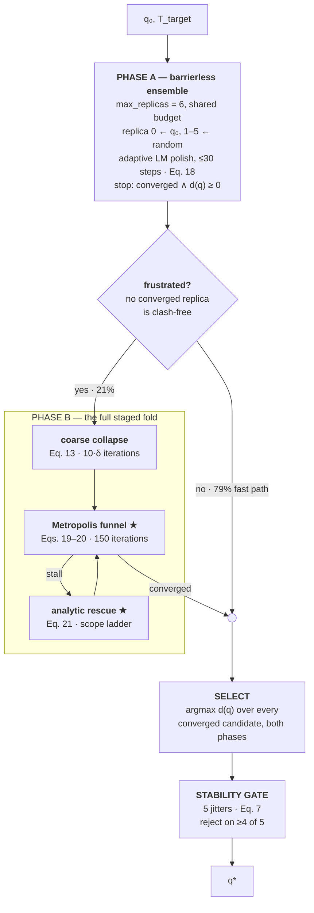

# Figure 1 — KineticFold's compute schedule

**Build brief for an external tool** (Illustrator / Figma / draw.io). This file is the
authority; build to it exactly. Deliver `fig_pipeline.pdf` + `fig_pipeline.png` into
`paper/figures/`.

This figure replaces `fig1_correspondence.svg`, which depicts no algorithm. It is the
first figure in the paper, so it is **Figure 1**; Figures 2–4 keep their numbers.

Embedded in [`academic.md`](../academic.md) §3.3, immediately after *"A single budget of
`max_replicas = 6` governs two phases."*

---

## 1. Canvas and export

| | |
|---|---|
| Width | **7.16 in** — full text width, matches `S.WIDE` in [`_style.py`](_style.py). IEEE two-column `figure*`, spans both columns. |
| Height | ~3.3 in (aspect ≈ 2.2 : 1). Do not exceed 3.6 in. |
| Primary output | **Vector PDF**, fonts embedded or converted to outlines. Required by [`README.md`](README.md) for `\includegraphics`. |
| Secondary output | **PNG @ 300 dpi**, same name, for the Markdown preview. |
| Background | White, opaque. |

Everything must stay legible at **column scale** — assume a reader at 100% zoom on a
printed two-column page. If a label cannot be read at that size, shorten the label; do not
shrink the type below the sizes in §3.

---

## 2. Palette

Reuse the paper's existing Okabe–Ito assignments from [`_style.py`](_style.py) so the
figure reads as one system with Figures 2–4. Colour follows the **entity**, never the rank.

| Role | Hex | Rationale |
|---|---|---|
| Phase A, fast path | `#009E73` | KineticFold's hero green in every other figure |
| Phase B | `#CC79A7` | StagedFold's colour — Phase B *is* the staged fold |
| Decision gate | `#E69F00` | freed when LangevinFold left the paper |
| Terminal (select / stability / `q*`) | `#333333` | neutral; shared by both paths |
| Rules, arrows, body text | `#333333` | matches `axes.edgecolor` |
| Analog annotations | `#7A7A7A` | recessive register, italic |
| Container fills | tint of the band colour at **8 % opacity** | keeps text contrast |

Boxes: 1 pt stroke in the band colour, 8 % fill, **3 pt corner radius**. The decision gate
is a diamond, same stroke weight. Arrows: 0.9 pt, solid, filled triangular head ~5 pt.

---

## 3. Typography

Serif throughout — **Times New Roman**, falling back to STIXGeneral — matching both the
body text and `_style.py`'s `font.serif`.

| Element | Size | Style |
|---|---|---|
| Band titles (`PHASE A`, `PHASE B`) | 8.5 pt | bold, letter-spaced ~0.4 pt |
| Box titles | 8 pt | bold |
| Box body | 6.5 pt | regular |
| Equation references | 6.5 pt | bold, in the band colour |
| Edge labels (`yes` / `no` / `stall`) | 6.5 pt | regular |
| Analog annotations | 6.5 pt | *italic*, `#7A7A7A` |
| Footnote row | 6 pt | regular |

Set maths in the same serif. `q₀`, `q*`, `‖Δp‖`, `‖Δω‖`, `d(q)`, `δ`, `λ`, `φᵢ`, `Tₜ` must
render as proper glyphs — no ASCII substitutes.

---

## 4. Wireframe

Three bands. Band 1 is the fast path, band 2 the escalation, band 3 the shared terminal.
The two paths **merge** before band 3 — this is load-bearing, see §6.

```
┌───────────────────────────────────────────────────────────────────────────────────────┐
│ BAND 1              analog: kinetic partitioning — the barrierless fraction            │
│                                                                                        │
│ q₀, T_target ──▶ ┌────────────────────────┐ ──▶ ◇ frustrated? ◇ ─── no ───────────┐   │
│                  │  PHASE A               │     no converged replica              │   │
│                  │  barrierless ensemble  │     is clash-free                     │   │
│                  └────────────────────────┘            │ yes                      │   │
└────────────────────────────────────────────────────────┼──────────────────────────┼───┘
                                                         ▼                          │
┌────────────────────────────────────────────────────────────────────────────┐      │
│ BAND 2   PHASE B — the full staged fold          frustrated targets only   │      │
│  analog:  hydrophobic collapse    folding funnel      chaperone (GroEL)    │      │
│  ┌───────────────┐      ┌──────────────────┐      ┌──────────────────────┐ │      │
│  │ coarse        │ ───▶ │ Metropolis       │─stall─▶ analytic rescue  ★  │ │      │
│  │ collapse      │      │ funnel        ★  │ ◀────┤                      │ │      │
│  └───────────────┘      └──────────────────┘      └──────────────────────┘ │      │
│                                  │ converged                               │      │
└──────────────────────────────────┼─────────────────────────────────────────┘      │
                                   └──────────────────┬─────────────────────────────┘
                                                      ▼  both paths merge
┌───────────────────────────────────────────────────────────────────────────────────────┐
│ BAND 3                        analog: native-state stability                           │
│    ┌──────────────────────────────┐        ┌──────────────────────────────┐            │
│    │ SELECT                       │  ───▶  │ STABILITY GATE               │ ──▶  q*    │
│    │ argmax d(q) over every       │        │ 5 jitters, reject on ≥4 of 5 │            │
│    │ converged candidate          │        │                              │            │
│    └──────────────────────────────┘        └──────────────────────────────┘            │
└───────────────────────────────────────────────────────────────────────────────────────┘

★ replaces StagedFold's greedy Eq. (15) / finite-difference Eq. (17)
```

**Layout rules**

- The `no` branch must route *clear of* the Phase B container — around it, never through it.
- Phase B's three boxes are horizontally aligned, equal height, with the rescue loop-back
  drawn *below* them inside the container.
- Bands 1 and 3 share a left margin; Phase B's container is inset from it so escalation
  reads as a detour off the main spine.
- The analog annotations sit directly above the element they name, in the recessive grey.

---

## 5. Node inventory — exact text

### Input
`q₀, T_target`

### PHASE A — barrierless ensemble
*analog: kinetic partitioning — the barrierless fraction*

- `max_replicas = 6` — one budget, shared with Phase B
- replica 0 seeds from `q₀`; replicas 1–5 from random configurations
- each replica: adaptive LM polish, **≤ 30 steps** — **Eq. (18)**
- per-step damping: accept → `λ ← max(0.5λ, 1e-4)`; reject → `λ ← min(2.5λ, 2.0)`; `λ₀ = 0.08`
- replica stops on `‖Δp‖ < pos_tol ∧ ‖Δω‖ < orient_tol`, or on `λ ≥ 2.0`
- ensemble stops at the first replica that converges **and** is clash-free, `d(q) ≥ 0`

### GATE — frustrated?
*analog: kinetic partitioning — the split*

Diamond. Text inside: **frustrated?** / `no converged replica is clash-free`

- **no** → band 3. Edge label: `no — clash-free replica found` + the fast-path share (§7)
- **yes** → Phase B. Edge label: `yes — escalate` + the escalation share (§7)

### PHASE B — the full staged fold
Container subtitle: *fires only on frustrated targets · up to `max_replicas` folds ·
stops on the first clean fold or after 2 collision-aware converged folds*

| Box | Title | Body | Analog |
|---|---|---|---|
| B1 | **coarse collapse** | detuned DLS — **Eq. (13)**, `λ² = 0.15²`, step scale 0.4 · **`10·δ` iterations**, `δ = 1 + min(reach/reach_max, 1) + min(κ(J(q₀))/100, 1) ∈ [1,3]` | *hydrophobic collapse* |
| B2 | **Metropolis funnel ★** | 150 iterations · sweeps **all n joints** every *other* iteration, `U(−rₜ, rₜ)`, `rₜ = 0.5·0.985ᵗ` · accept by **Eq. (19)** under geometric cooling **Eq. (20)**, `T₀ = 0.3 → T_f = 0.01` · energy **Eq. (14)** | *folding funnel* |
| B3 | **analytic rescue ★** | stall = last-10-energy window improves `< 2e-4` · joint `i* = argmaxᵢ φᵢ` — **Eq. (21)** · re-randomize a contiguous window on the ladder `[n/6, n/2, 5n/6, n]` (UR5 `[1,3,5,6]`); only the last rung is a full reseed | *chaperone action (GroEL)* |

### SELECT
`argmax d(q)` over **every converged candidate from both phases** — the returned
configuration is the one with the largest self-clearance.

### STABILITY GATE
*analog: native-state stability*

5 perturbations `δqₖ ~ 𝒩(0, σ²I)`, `σ` scaled by arm reach to ≈1 mm tip displacement ·
reject if **Eq. (7)** error rises above `10·(pos_tol + 0.3·orient_tol)` on **≥ 4 of 5**

### Output
`q*` — *success* iff `‖Δp‖ < 1 mm ∧ ‖Δω‖ < 10 mrad`; *clean* iff also `d(q) ≥ 0`

### Footnote row (bottom of canvas, 6 pt)
> ★ replaces StagedFold's greedy Eq. (15) and finite-difference Eq. (17). Italic labels name
> the folding process each element ports.

---

## 6. Edge inventory

| From | To | Label | Note |
|---|---|---|---|
| input | Phase A | — | |
| Phase A | gate | — | |
| gate | **band 3 merge** | `no` + fast-path share | routes around the Phase B container |
| gate | Phase B (B1) | `yes` + escalation share | |
| B1 | B2 | — | |
| B2 | B3 | `stall` | rescue fires *inside* the search |
| B3 | B2 | — | **loop-back**, drawn below the boxes |
| B2 | band 3 merge | `converged` | |
| merge | SELECT | — | both paths join *before* SELECT |
| SELECT | STABILITY GATE | — | |
| STABILITY GATE | `q*` | — | |

**Callout on B2** (small leader line, not a box):
`‖Δp‖ < 0.05 ∧ ‖Δω‖ < 0.2 → LM polish ≤ 12 steps (Eq. 18's rule)`
with the gloss *replaces the fine DLS step of Eq. (16), not the Metropolis step*.

### Three things that are easy to draw wrong

1. **The stability gate is not a Phase-B stage.** It runs once, after the merge, on the
   winner from *either* phase — fast-path solutions are gated too. (Verified in both
   [`solver.py:481`](../../backend/app/solvers/protein_fast/solver.py#L481) and
   [`pik_v4.hpp:252`](../../backend/cpp/pik_v4.hpp).)
2. **SELECT is a real step, not bookkeeping.** The answer is the *most clearance-positive*
   converged candidate pooled across both phases — part of why KineticFold wins on
   self-collision.
3. **The in-loop LM replaces the gradient step, not the Metropolis step.** The Metropolis
   sweep keeps firing every other iteration regardless.

---

## 7. Gate labels — measured

Measured by replaying Phase A over the master benchmark's own targets and per-trial RNG
convention (`seeds = [1,2,3]`, 100 trials/cell, `n = 300` per cell). The gate depends only
on Phase A's outcome, so this reproduces it exactly.

| Arm | Scenario | n | escalate |
|---|---|---:|---:|
| UR5 | open | 300 | **7.0 %** |
| UR5 | near-singular | 300 | 20.3 % |
| UR5 | cluttered | 300 | 23.7 % |
| Franka | open | 300 | 12.3 % |
| Franka | near-singular | 300 | 11.7 % |
| Franka | cluttered | 300 | **50.0 %** |
| planar | open / near-sing. / cluttered | 900 | 9.3 / 53.0 / 63.7 % |

**Use on the figure** (two physical arms, `n = 1800`):

- `no` branch → **79 % — fast path**
- `yes` branch → **21 % — escalate**

State the scope on the figure itself as `UR5 + Franka, n = 1800`. All three arms together
is 72 % / 28 % (`n = 2700`) if a whole-benchmark framing is preferred instead.

Note for whoever cites this: measured on the **Python reference**. The benchmark's latency
columns come from the C++ port, whose RNG stream differs; FK/energy parity is ≤1e-11 and
success/collision are statistically identical, so the rate is representative rather than
bit-identical.

---

## 8. Mermaid skeleton

Structural starting point only — importable into draw.io. Typography, palette, and layout
still follow §2–§4.



---

## 9. Traceability

Every claim on the figure, against the paper and the implementation. A builder who changes
a number without changing both sources has introduced an error.

Anchored on sections, equation numbers, and function names rather than line numbers — line
numbers move on every edit to the paper.

| Element | [`academic.md`](../academic.md) | [`solver.py`](../../backend/app/solvers/protein_fast/solver.py) |
|---|---|---|
| `max_replicas = 6`, one budget | §3.3.1, *"governs two phases"* | `solve_protein_fast` signature; Phase A loop |
| replica 0 ← `q₀`, rest random | §3.3.1, *Phase A* | Phase A loop, `spec.random_config(rng)` |
| LM polish ≤ 30 steps | §3.3.1, *Phase A* | `_lm_polish_fast(..., 30, ...)` |
| λ accept/reject, `λ₀ = 0.08` | **Eq. 18** | `_lm_polish_fast` |
| replica stop `λ ≥ 2.0` | §3.3.1, *"persistent overshoot"* | `_lm_polish_fast` |
| ensemble stop on clean converged | §3.3.1, *"Phase A stops early"* | `if d >= 0.0: break` |
| frustration criterion | §3.3.1, *"frustration criterion"* | `_have_clean()`; `if not _have_clean():` |
| Phase B stop rule (clean, or 2 folds) | §3.3.1, *"at most two … converged folds"* | `phase_b_converged >= 2` |
| coarse collapse, `10·δ` | **Eq. 13**; §3.3.1 *"contact-order-inspired"* | `_fold_once` stage 2; `difficulty` / `s2` |
| Metropolis accept, geometric cooling | **Eqs. 19–20** | `_fold_once` funnel loop |
| sweeps all n joints, every other iteration | §3.3.1 states it per-candidate | `if it % 2 == 0:` → `for i in range(n)` |
| radius `rₜ = 0.5·0.985ᵗ` | **Eq. 15** | `search_radius`, `radius_decay` |
| energy weights | **Eq. 14** | `total_energy_fast(..., *_W)` |
| stall window 10, `2e-4` | §3.2.4 | `stuck_window`, `stuck_eps` |
| analytic rescue | **Eq. 21**; §3.3.1 | `frustration_index(spec, q, T_target)` |
| scope ladder `[n/6, n/2, 5n/6, n]` | §3.2.4 | `scope_sizes` |
| in-loop LM ≤12 at `0.05 / 0.2` | §3.3.1 | `if pos_e < 0.05 and orient_e < 0.2:` |
| SELECT `argmax d(q)` | **not stated** | `max(converged_candidates, key=lambda c: c[0])` |
| stability gate, after the merge | §3.3.1 lists it *inside Phase B* | after both phases, `if success:` jitter block |
| 5 jitters, ≥4 of 5, **Eq. 7** threshold | §3.2.5 | `n_jit = 5`; `jitter_failures >= n_jit - 1` |
| success `1 mm / 10 mrad` | §3.1, *"The task"* | — |
| clean `d(q) ≥ 0` | §3.1, *"The steric constraint"* | `self_collision_min_distance` |

C++ counterpart for the last three rows: [`pik_v4.hpp`](../../backend/cpp/pik_v4.hpp),
`solveProteinFast` — selection and jitter gate are identical to the Python.

**Two rows above disagree with the prose** and are drawn per the code. Both are flagged for
the paper, not silently reconciled:

- **SELECT is undocumented.** §3.3 never mentions that the returned configuration is the
  maximum-clearance converged candidate pooled across both phases.
- **The stability gate's placement is misstated.** §3.3 L402–403 lists it as a Phase-B stage
  (*"coarse collapse → funnel → chaperone rescue → stability gate"*); it actually runs once
  after both phases and gates fast-path solutions too.
